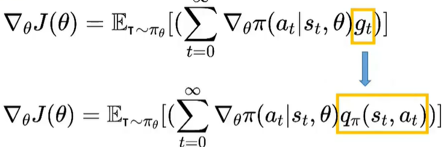

- ### 策略梯度方法的局限性
      策略梯度方法通过优化策略函数直接解决强化学习问题，核心思想是通过以下公式更新策略参数
  局限性：
  高方差：直接使用环境反馈（奖励）计算梯度会导致策略梯度的方差很高，影响优化效率；
  低效率：由于奖励信号传递较慢，可能需要大量采样才能学到有效的策略。
  **为了解决策略梯度这些问题，研究者引入了Critic**，用于降低方差并加速策略优化。
-
- ### Actor-Critic
- Actor-Critic算法结合了策略梯度方法（Policy Gradient）和值函数估计
- 核心思路是 ：
- 1）参数化值函数---通过Actor（策略函数π(a|s)）选择动作，通过Critic（值函数Qπ(s,a)）评估这些动作。
  这种参数化方法使得算法能够处理连续状态空间和/或连续动作空间的问题。
- 2）动作-价值函数 替换 回报G ----  注意： gt的采样是要一次完整的模拟，qπ  的采样就可以只是一步动作可以使用时序差分
- 