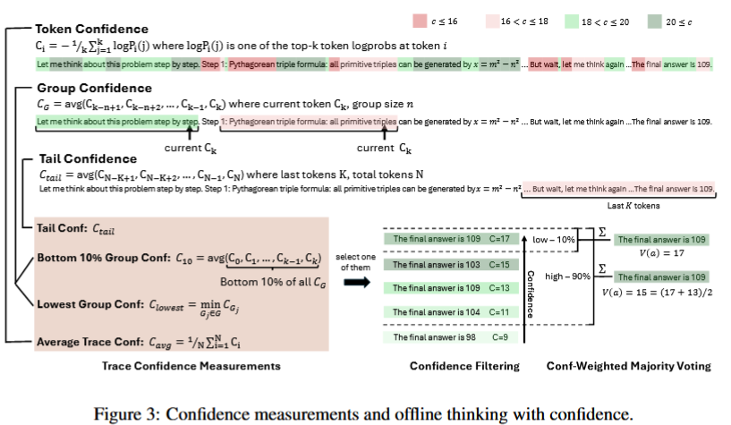
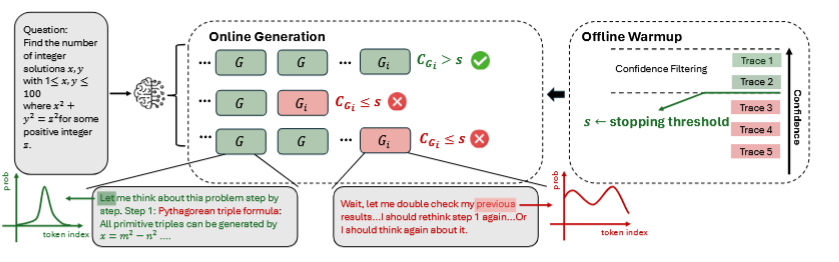

- Deep Think with Confidence (深度思考，自信表达)
-
- 论文地址与代码参考：
- https://jiaweizzhao.github.io/deepconf/
  https://jiaweizzhao.github.io/deepconf/static/htmls/code_example.html
  https://jiaweizzhao.github.io/deepconf/static/pdfs/deepconf_arxiv.pdf
  https://github.com/vllm-project/vllm/pull/23201/
  vllm/v1/engine/logprobs.py
  vllm/v1/engine/output_processor.py
-
- **深度自信思考（DeepConf）是一种 并行思考 方法，DeepConf 用“模型自己给出的置信度信号”来甄别/提前终止低质量的思维链，在不额外训练的前提下，同时提升推理准确率并大幅省 Token。**
-
-
- ### 置信度指标 定义：
- **token entropy 令牌熵**
  给定语言模型预测的令牌分布 在位置 ，令牌熵定义为：
-
  $$H_i = -\sum_j P_i(j)\log P_i(j)$$
- **token confidence 令牌置信度**
-
  $$ C_{i}=-\frac{1}{k} \sum_{j=1}^{k} \log P_{i}(j)$$
- 我们将位置 i 的 top-k 令牌的负平均对数概率定义为令牌置信度 C_{i}。其中，k 表示考虑的 top 令牌数量。高置信度对应于峰值分布和更高的模型确定性，而低置信度则表示令牌预测的不确定性。
-
  <pre>
  import torch
  top_ks_1 = torch.tensor([0.6, 0.1, 0.05, 0.02])  # Peaked Distribution, 模型非常确定
  top_ks_2 = torch.tensor([0.15, 0.14, 0.13, 0.11]) # Flat Distribution - 模型非常不确定
  C_i = lambda xs: - torch.mean(torch.log(xs))
  C_i(top_ks_1), C_i(top_ks_2) </pre>
- **说明一个token上topK个可能得字符，更尖锐的概率分布，会得到一个更高的置信度**
-
- **平均推理置信度**. 令牌级指标需要汇总以评估整个推理轨迹。遵循 Kang 等人（2025 年）的方法，我们采用平均推理置信度（也称为自我确定性）作为轨迹级质量指标：
-
  $$C_{\mathrm{avg}}=\frac{1}{N} \sum_{i=1}^{N} C_{i}$$
- 其中： N一般去14~22个字符这样大小的窗口
- ----
- ### 如何度量一个推理链的置信度
- **Group Confidence 组内置信度：**  
  $$C_{\text{group}} = \frac{1}{n}\sum_{i=k-n+1}^{k} C_i \quad\text{（序列长度为 } n\text{，组大小）}$$
- 对最近 n个 token 做滑窗平均(窗口起点是第k个字的位置)，得到更平滑的局部信号。
-
- 1. 底部 10 % 组置信度（Bottom 10 % Group Confidence）
- 将一条推理链中最低 10 % 组置信度的平均值。 $$C _ { \mathrm { b o t t o m } - 1 0 } ( t ) = { \frac { 1 } { | G _ { b } | } } \sum _ { G _ { j } \in G _ { b } } C _ { G _ { j } } $$
-
- 2. 最低组置信度（Lowest Group Confidence）
- 该指标是整个推理链的最低的那个组内置信度：
-
  $$
  C_{\text{least}}(t)=\min_{G_j\in G}\;C_{G_j}
  $$
- 其中 $G$ 是推理链中所有 token 组的集合。
-
- 3. 尾部置信度（Tail Confidence） 
  通过关注推理链末尾部分来评估其可靠性。该度量的动机是：在长链思考中，推理质量常在结尾处下降，而最后几步对正确结论至关重要。尾部置信度 $C_{\text{tail}}$ 定义
-
  $$C_{\mathrm{tail}}(t)=\frac{1}{|T_{\mathrm{tail}}|}\sum_{t\in T_{\mathrm{tail}}}C_{t},$$
- ###  推理阶段，如何使用置信度指标，在线思考
- DeepConf 的核心：在生成中/生成后，用模型内部的 token 分布计算局部置信度，据此过滤掉不靠谱的轨迹，或者在轨迹变“没谱”时立刻提前停。它分两种场景：
- 离线（offline）：先生成完一批轨迹，再用置信度加权投票/过滤后投票。
  在线（online）：边生成边看“分组置信度”是否跌破阈值，若跌破则立即截断该轨迹，节省大量 Token。
- 
-
-
- 我们提出了 **DeepConf-low** 和 **DeepConf-high** 两种基于**最低组置信度**的算法，能够在在线思考过程中**自适应地停止生成并调整追踪预算**。该方法包含两个主要组成部分：
  
  1. 离线预热（Offline Warm-up）
  2.自适应采样（Adaptive Sampling）
-
- #### 1. 离线预热阶段（Offline Warm-up）
  
  DeepConf 需要一个离线预热阶段来建立在线决策的**停止阈值** \( s \)。  
  针对每个新提示，生成 \( N_{\text{init}} \) 条推理轨迹（例如 \( N_{\text{init}} = 16 \)）。  
  
  **停止阈值定义**：
  
  \[
  s = \text{Percentile}_{100 - n}\left(\{ C_t : t \in T_{\text{warmup}} \}\right)
  \]
- \( T_{\text{warmup}} \)：所有预热轨迹的集合
- \( C_t \)：轨迹 \( t \) 的置信度
- \( n \)：期望保留比例  
  
  **具体设置**：
- **DeepConf-low**：统一采用前 \( n = 10\% \)（对应第 90 百分位数）作为阈值
- **DeepConf-high**：统一采用前 \( n = 90\% \)（对应第 10 百分位数）作为阈值  
  
  该阈值确保在线生成时，当轨迹置信度低于预热阶段保留前 \( n\% \) 最高置信度轨迹的水平时，即终止该轨迹。
- #### 2. 自适应采样阶段（Adaptive Sampling）
  
  在 DeepConf 中，对所有方法采用**自适应采样**技术，根据问题难度动态调整生成的轨迹数量（参考 Xue 等人，2023）。
  
  **难度评估**基于生成轨迹间的一致性程度，通过以下公式量化：
  
  \[
  \beta = \frac{V(a)}{\sum_{a} V(a)}
  \]
- \( V(a) \)：多数投票权重
- \( \sum_{a} V(a) \)：总投票权重
- \( T \)：预设的共识阈值  
  
  **决策规则**：
- 如果 \( \beta < T \)，模型未对当前问题达成共识，追踪生成将继续进行，直到达到固定的追踪预算 \( B \)。
- 否则，追踪生成停止，利用现有追踪结果确定最终答案。
  
  ---
- 由于我们采用**最低组置信度策略**，足够大的预热集能准确估计停止值  s 。因此，任何在线终止的轨迹都具有组置信度 \( < s \)，将被离线过滤器排除。由此可见，在线流程近似模拟了离线最低组置信度策略，其准确度随 \( N_{\text{init}} \) 增大而趋近离线准确度（详见附录 B.2）。图 4 展示了在线生成流程的示意图，算法 2 则提供了该算法的具体实现细节。
-
- 
-
-
-
-
-
- #### 和“经典方法/相关工作”怎么对齐？
  Self-Consistency（多数表决）：Wang et al.（2023）提出“并行思考 + 多数表决”，是本论文主要对比基线；DeepConf 属于“让每票有权重”，并辅以过滤与提前停来控成本。
  动态/软投票：如 Xue et al.（2023）动态投票、后续的 Soft Self-Consistency/Ranked Voting 等，强调更聪明地聚合；DeepConf 的不同在于用模型内生置信度的“局部信号”当过滤器，尤其是最低分组/尾部，而非只看整体。
  不确定性/置信度路线：语义熵（Farquhar, 2024）、Token-level UQ（Fadeeva, 2024）、Self-Certainty（Kang, 2025）等都用“分布统计”衡量可靠性；DeepConf 指出纯全局平均会掩盖中段崩盘，因此转向局部滑窗 + 尾部，并把信号落到在线提前停上
-
-