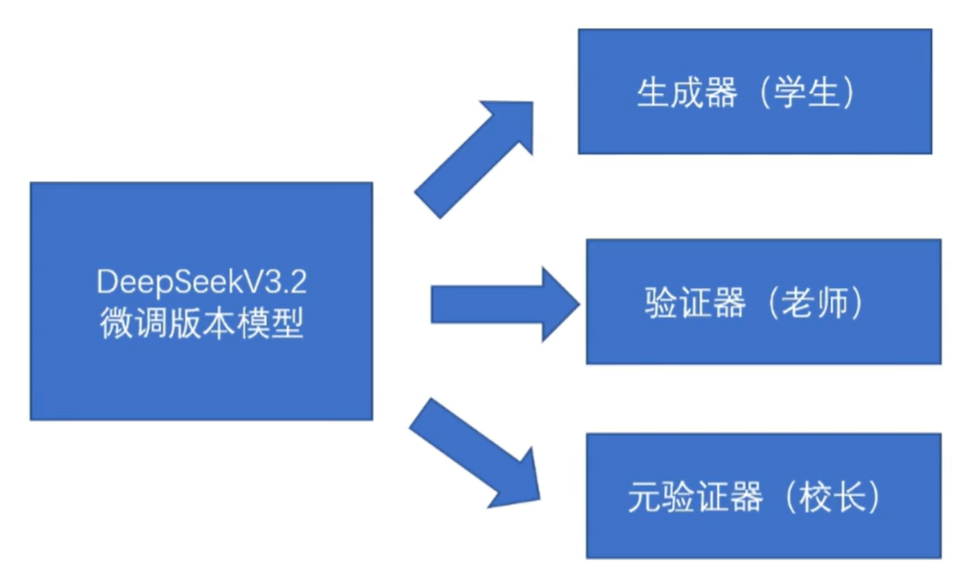
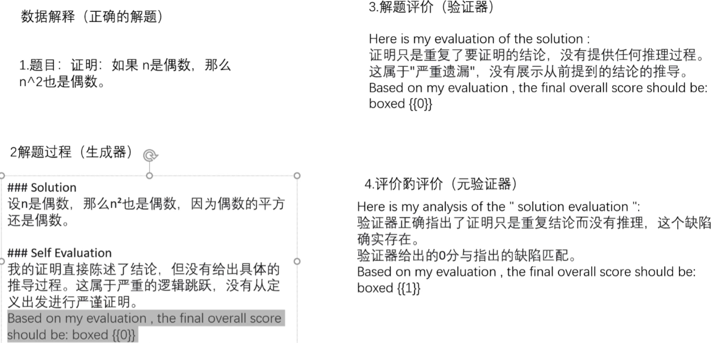
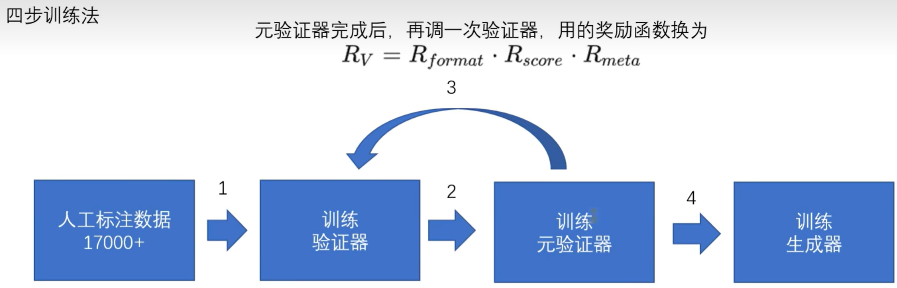
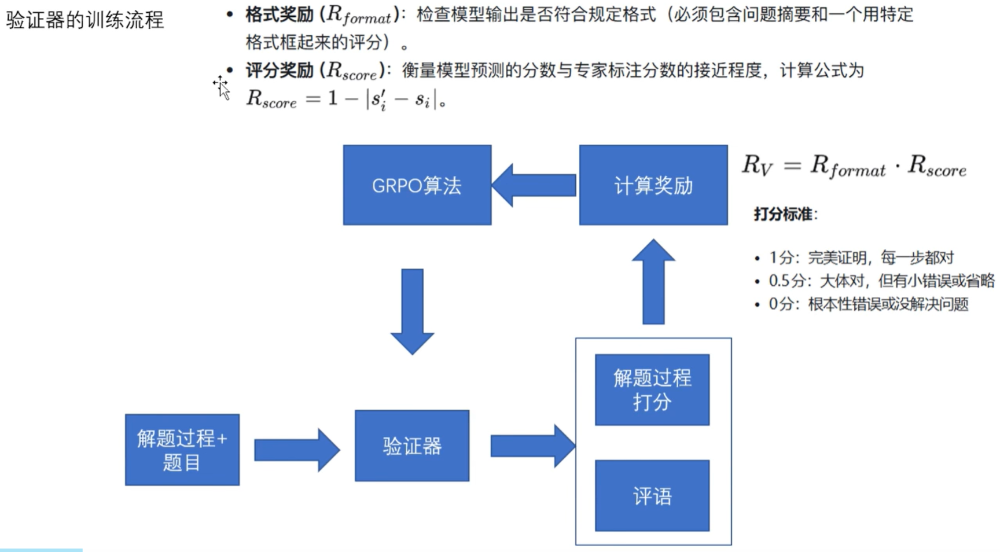
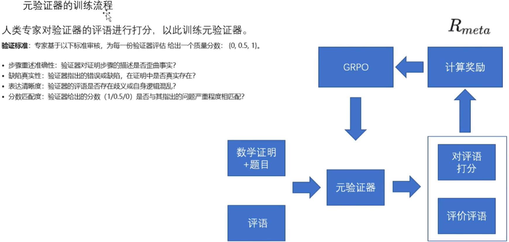
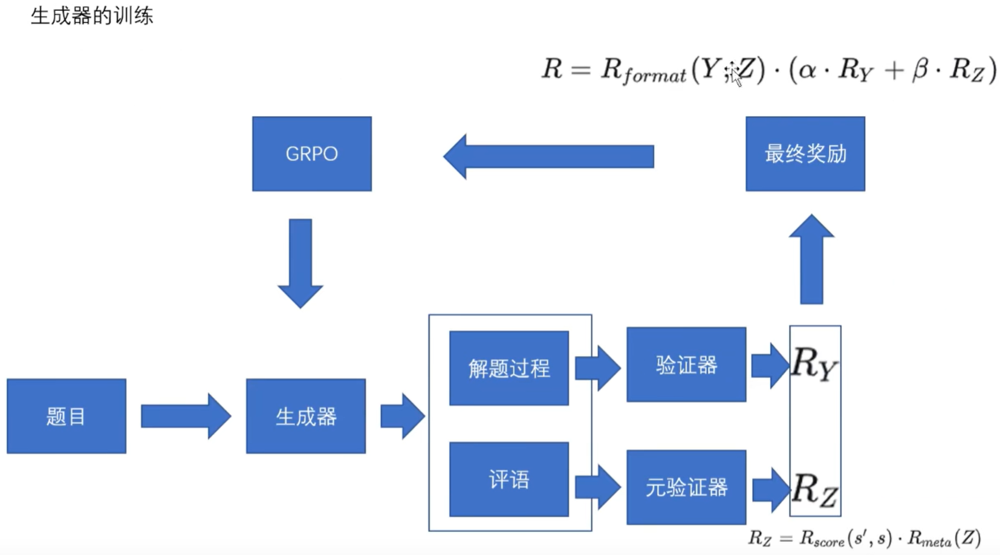
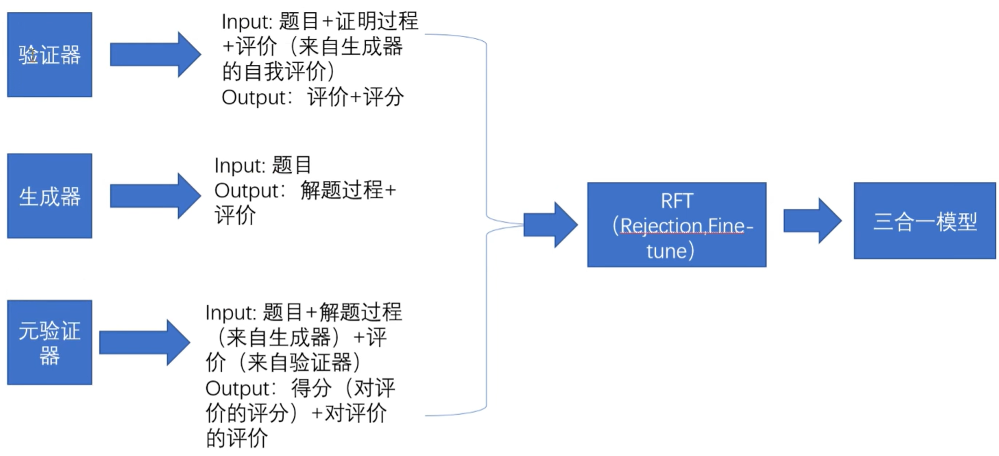
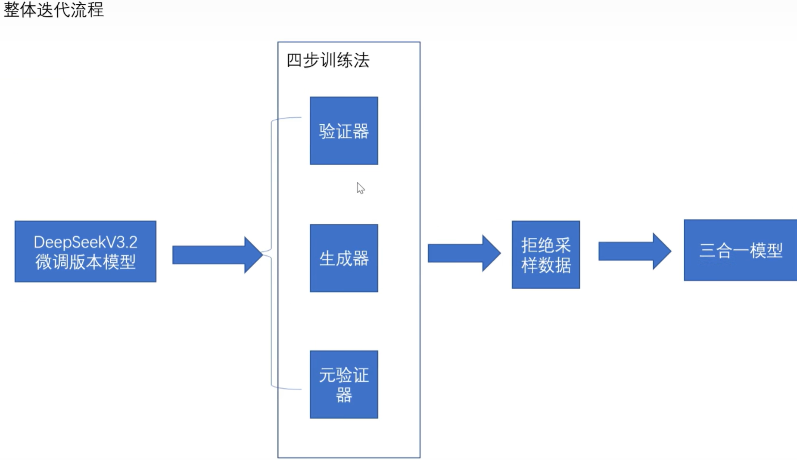
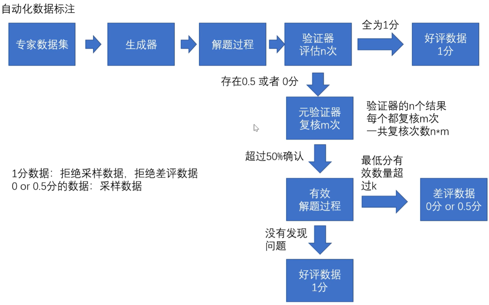
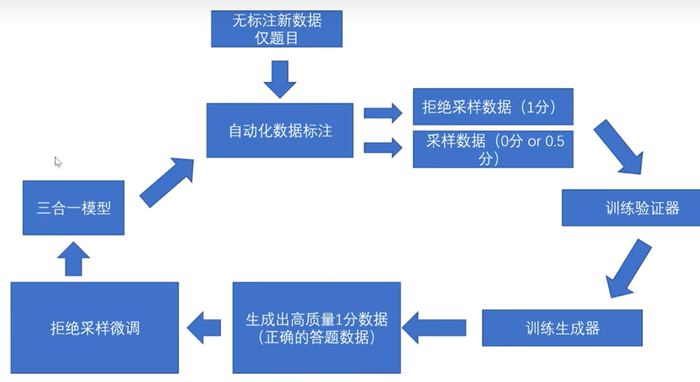

## 简介
DeepSeekMath-V2 是 DeepSeek 在 2025 年 11 月 27 日刚发布的数学领域的大模型，它的特点是「自我可验证」，不仅是算答案更关注定理证明过程。Apache 2.0 许可证明确允许商业使用。685 B 激活参数的 MoE（Mixture-of-Experts），基于 DeepSeek-V3.2-Exp-Base 再训练，每 token 实际激活约 21 B。上下文 128 k-163 k token，采用 Multi-head Latent Attention（MLA）把 KV-cache 压到原来的一半，长证明也能一次读全 。
- ### 三件套架构
  ① Generator生成器（写证明过程并给出自我评价）→ ② Verifier验证器（步骤级打分 0/0.5/1）→ ③ Meta-Verifier元验证器（检查 verifier 本身有没有误判），形成自博弈 RL 循环，达到自我进化的目标。
  | 比赛             | 成绩                      | 备注                       |
  | -------------- | ----------------------- | ------------------------ |
  | IMO 2025       | 6 题中完整做出 5 题            | 金牌线，AI 首次在正式 IMO 拿到「金牌级」 |
  | CMO 2024       | 满分                      | 中国数学奥林匹克                 |
  | Putnam 2024    | 118 / 120               | 超过人类最高分 90 分             |
  | IMO-ProofBench | 超越 DeepMind 的 DeepThink | 在 DeepMind 官方基准上依旧领先     |
-
-
- ### 数学领域的问题背景
- **定位**：专为解决数学证明题设计，区别于常规大模型（如DeepSeek-v3.2）。
- **挑战**：
    当前主流的数学推理强化学习方法存在根本性缺陷:
    - 1.“结果导向”的陷阱:现有的强化学习(RL)大多只奖励“最终答案是否正确”。这导致了一个严重问题:模型可能通过错误的逻辑甚至运气蒙对了答案，但推理过程却是经不起推敲的。
    - 2.无法应对“证明题”:很多高阶数学任务(如定理证明)并没有一个简单的数值答案，其核心在于严谨的推导步骤。传统的“对答案”式奖励机制在这里完全失效。
    - 3.缺乏自我纠错能力:经过传统训练的模型往往缺乏验证证明有效性的能力。它们有很高的“误报率(False-positive)，经常一本正经地把充满逻辑漏洞的证明判定为正确的。
    - 4.迈向更强的泛化:如果AI要解决人类尚未解决的数学难题(open Problems)在没有参考答案的情况下更严谨的自我验证的能力。
- **突破点**：通过强化学习实现自我训练，无需标注数据即可提升能力。
-
- ### 方法论
- ##### 1.模型结构
-
- 
- 三个模型各自微调(基于DeepSeek-v3.2微调)
- 类似GAN但引入三重监督机制
- 通过提示词切换角色功能（同一模型三种用途）
  三个模型分别是:
  - a. **生成器（学生）**：
     - 输入：数学题目
     - 输出：解题过程 + 自我评估（证明步骤+自我评分）
  - b. **验证器（老师）**：
     - 评估解题过程正确性（0/0.5/1分制）
     - 格式要求严格（固定输出模板）
  - c. **元验证器（校长）**：
     - 监督验证器的评判公正性
     - 形成闭环反馈系统
  
  
  举例说明：
  

## 2.数据集准备
冷启动数据构建:
- 1.从Art of Problem Solving (AoPS) 网站抓取了17,503道需要证明的竞赛题目(主要来自数学奥林匹克、国家队选拔赛等，集中于2010年后)。
- 2.使用DeepSeek-V3.2-Exp-Thinking的一个变体生成候选证明，并通过多轮迭代提示来改进证明的完整性和严谨性。
- 3.由数学专家对随机抽取的证明进行人工评分，最终得到验证器的初始训练数据集D„={(Xi,K,s)}。
  评分体系:
  - 1分:完整且严谨，所有逻辑步骤都有清晰的论证支撑，
  - 0.5分:整体逻辑正确，但存在小错误或省略了部分细节。0分:存在根本性缺陷，如致命的逻辑错误或关键步骤缺失。
 
  数据构建具体步骤:
  - 第1步:搜集题目
   来源:Art of Problem Solving+(AoPs)数学社区
   数量:17,503道数学问题
   特点:都是需要“证明”的题目，来自 IMO+CMo+等顶级竞赛
  - 第2步:生成“参考答案”
   方法:让现有的LLM模型尝试解答所有题目
   结果:得到各种质量参差不齐的证明(有的完美，有的有错误)
  - 第3步:专家“标准答案”
   方法:请数学专家按照统一标准给证明打分
   成果:得到带标签的数据集(问题，证明，专家分数)，即高质量的“标准答案”
  - 第4步:构建“批改质量”数据
   方法:专家检查老师的批改是否合理
   得到元验证数据集(问题，证明，老师批改，专家评分)，即高质量的“批改质量数据

## 3.训练流程详解
### 四步训练法

1. **冷启动阶段**：
   - 初始数据：17,000道人工标注的数学证明题
   - 标注标准：1分（完美）、0.5分（部分正确）、0分（错误）
2. **验证器训练**：
   - 奖励函数 = |模型评分-人工评分| + 格式分
   - 使用PPO算法强化学习
   - 验证器训练过程：
   
3. **元验证器训练**：
   - 评估验证器的评判质量
   - 相对简单的监督任务
   - 元验证器训练过程:
   
4. **生成器训练**：
   - 综合验证器和元验证器的反馈
   - 奖励函数包含：
     - 解题正确性（60%权重）
     - 自我评估准确性（30%）
     - 格式合规性（10%）
   - 生成器训练过程:
   
   - 生成器打分说明奖励机制引导学生
     - 首要目标:写出正确的证明
     - 次要目标:诚实评估自己
     - 硬性要求:遵守输出格式(一票否决)
  
5. **模型训练后，进行融合三合一模型训练**：
选取1分数据(高质量解题数据)

## 4.自我博弈阶段

其中有三类数据：
a.老师没有判错题的情况下的 好评数据
b.老师没有判错题的情况下的 差评数据
c.老师冤枉了学生的情况下的 好评数据

