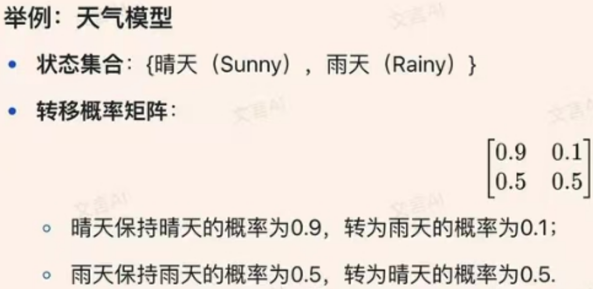
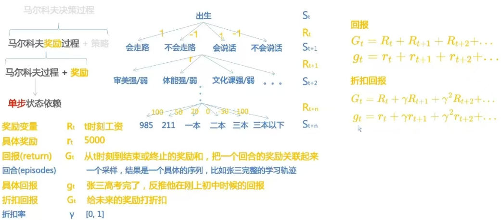
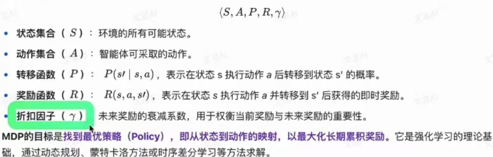
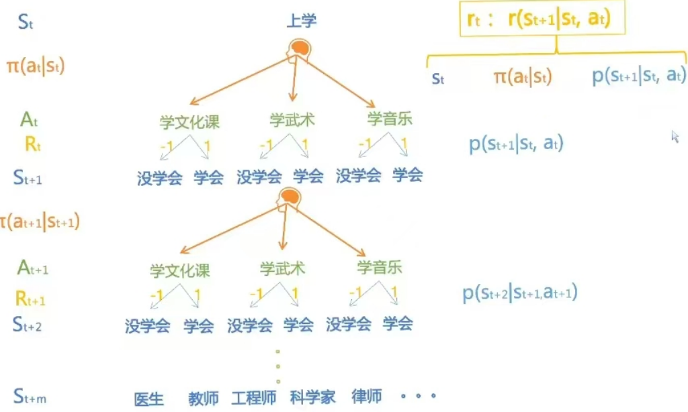

- 面对决策型任务如何用数学去描述这个过程？----- MDP马尔科夫决策过程
- #### 1. 马尔科夫过程
- 马尔可夫（Markov）指的是**一种无记忆性（Memoryless Property）**，即未来状态仅依赖于当前状态，而与过去的历史状态无关。
- ##### 举例例如：
- 在天气预测中，若“明天的天气只由今天的天气决定”，而不受昨天或更早天气的影响，则称该过程具有马尔可夫性。
  {:height 250, :width 450}
  
  马尔可夫最重要的性质是什么？
  无记忆性（Memoryless Property）是其核心特性。
  这一性质使得建模和计算复杂度大幅降低：
- 无需维护完整历史状态，只需关注当前状态。
- 在强化学习、排队论、自然语言处理等领域广泛应用，是马尔可夫模型的理论基石。
  数学表达为：
  \[ P(S_{t+1} \mid S_t, S_{t-1}, ..., S_0) = P(S_{t+1} \mid S_t) \]
  这种性质的核心是无记忆性，未来仅由现在决定，与过去无关。
-
-
- #### 2.马尔科夫奖励过程Markovrewardprocess(MRP)
- ** 引入了奖励机制**
- {:height 350, :width 550}
-
- #### 3.马尔科夫决策过程
- ** 引入了智能体**
- MDP可以由一个五元组表示：
- {:height 350, :width 550}
-
- {:height 400 :width 600}