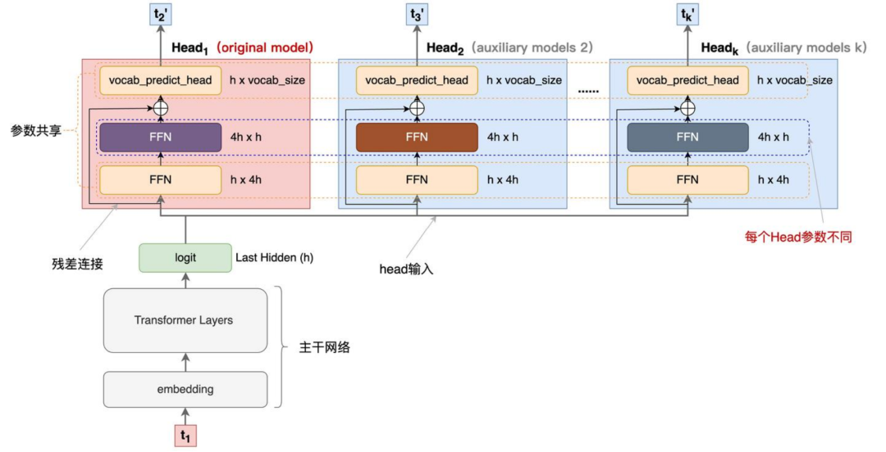
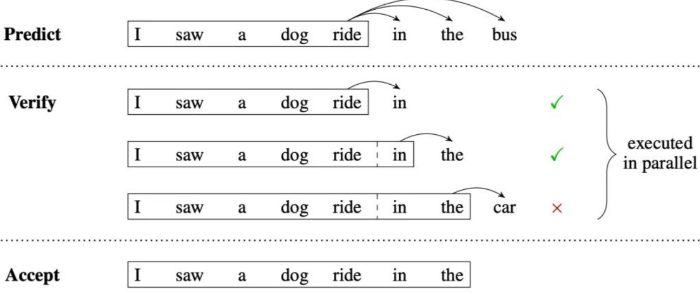

- ### MTP（Multi-token Prediction）的总体思路
- MTP（Multi-token Prediction）的总体思：让模型使用n个独立的输出头来预测接下来的n个token，这n个独立的输出头共享同一个模型主干。这样通过解码阶段的优化，将1-token的生成，转变成multi-token的生成，从而提升训练和推理的性能。
-
- 
-
- #### 为什么要做 MTP
  对于训练阶段，一次生成多个后续 token，可以一次学习多个位置的 label，这样可以增加样本的利用效率，提高训练速度；
  而在推理阶段，通过一次生成多个 token，可以实现成倍的解码加速，来提升推理性能。
-
- #### 整个推理过程解码过程
- 
- 解码过程主要分成三步：
  阶段 1：predict，利用 k 个 Head 一次生成 k 个 token，每个 Head 生成一个 token。
  阶段 2：verify，将原始的序列和生成的 k 个 token 拼接，组成 sequence_input 和 label 的 Pair 对。
  Pair<sequence_input, label>
  看图中的 verify 阶段，黑框里是 sequence_input，箭头指向的是要验证的 label。
  我们将组装的 k 个 Pair 对组成一个 batch，预测下一个token，检查 Head1 生成的 token 是否跟阶段 1预期的 label 一致。
  阶段 3：accept，选择 Head1 预估结果与 label 一致的最长的 k 个 token，作为可接受的结果。
  最优情况下，所有辅助 Head 预测结果跟 Head1 完全一样，也就是相当于一个 step 正确解码出了多个 token，这可以极大的提升解码效率。
-
-
-
-