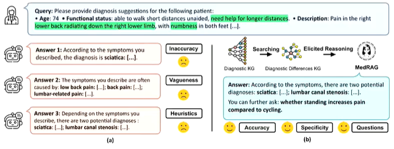
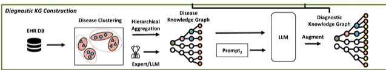
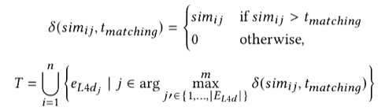
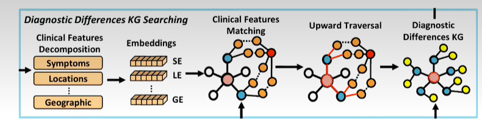
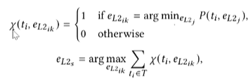
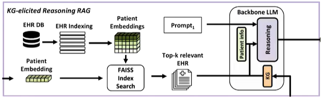
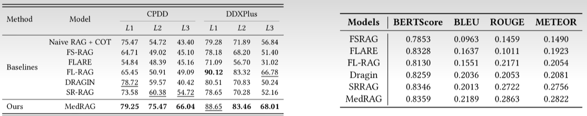
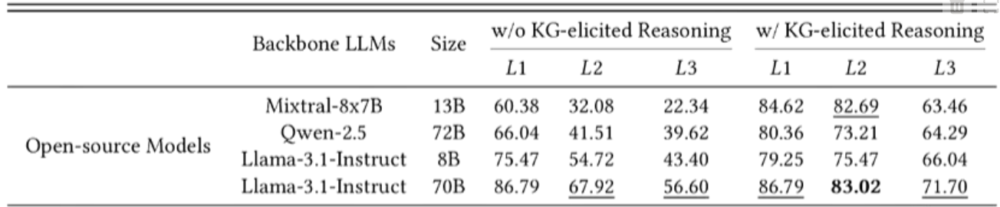

- ### 背景介绍
- 
-
- ### 1. 知识图谱的建立 Knowledge Graph Manifestation Augmentation
- 
- EHR 数据库中对同一种疾病存在不同的表述，我们首先通过疾病聚类将原始疾病描述集合 \(E_{L3_{raw}}\) 统一为 \(E_{L3}\)。
- \[E_{L3} = C(E_{L3_{raw}}, \mathcal{E}),\]
- 其中 C 代表聚类模型，E 是一个嵌入模型。
- 然后，我们使用统一后的 \(E_{L3}\) 通过分层聚合构建一个四层疾病知识图谱 \(G_D\)。图谱中从顶层到底层的路径为 \(E_{L1} \xrightarrow{r_s} E_{L2} \xrightarrow{r_s} E_{L3} \xleftarrow{r_m} E_{L4}\)。\(r_s\) 表示 is_a 关系，\(r_m\) 表示 has_manifestation_of 关系。
- \[G_D = \Theta(E_{Li}, M_h, \mathcal{E}), i = 3, 2.\]
- 我们应用基于 LLM 的主题聚合，使用 \(M_h\) 从 \(E_{L3}\) 中提取最相关的主题到子类别（\(E_{L2}\)）。这些子类别主题随后被进一步聚合到更高级别的类别中，形成从子类别到更广泛类别（\(E_{L1}\)）的分层结构。\(E_{L4}\) 为疾病对应的外在表现。
- Gemini 举例：心血管疾病（\(E_{L1}\)）\(\xleftarrow{is\ a}\) 冠状动脉疾病（\(E_{L2}\)）\(\xleftarrow{is\ a}\) 心肌梗死（\(E_{L3}\)）\(\xleftarrow{has\ manifestation\ of}\) 胸痛（\(E_{L4}\)）
-
-
- \( G_D \) 中的知识仅包含来自 EHR 数据库的信息，这在准确区分具有相似临床表现的疾病时是不够的，因此我们使用外部知识增强 \( E_{L4} \) 到 \( G_D \)。我们遍历所有疾病 \( e_{L3i} \in E_{L3} \)，并采用专门为搜索和生成疾病的细微差别而定制的提示 \( p_a \)。
  
  \[
  \{e_{L3_i}\}_{i=1}^n \xrightarrow{M_a(p_a, e_{L3_i})} \{e_{L4a_j}\}_{i=1,j=1}^{n,m_l}
  \]
  
  \[
  E_{L4} = E_{L4d} \cup E_{L4a},
  \]
  \[
  G = G_D \cup_{E_{L3}} \{E_{L3} \cup E_{L4}\}_{i=1}^n,
  \]
  
  其中 \( M_a \) 和 \( p_a \) 分别代表用于疾病表现增强的大型语言模型及其提示。
  
  最终的四层分层诊断知识图谱 \( G \) 是通过整合疾病知识图谱 \( G_D \) 和 \( E_{L4} \)（结合了 \( E_{L4a} \) 和 \( E_{L4d} \)）形成的。
-
- ### 2. 查询输入在知识图谱上的检索
- 给定查询 \( q \) 作为患者症状表现的描述，我们对 \( q \) 执行句子截断 (sentence trunking) 操作，将症状表现分解为更详细的特征
- 给定一个查询 \( q \)，我们计算特征 \( f_i \) 和 \( e_{L4d_j} \) 之间的语义相似度评分 \( sim \)：
- \[ sim_{ij} = \mathcal{S}(f_i, e_{L4d_j}, \mathcal{E}), \]
- 其中 \( \mathcal{S} \) 是相似度模型，\( \mathcal{E} \) 是嵌入模型。对于每个患者特征 \( f_i \)，我们检索 top-m 个最相似的 \( e_{L4d_i} \)。系统总共在 \( \mathcal{G} \) 中检索 \( n \times m \) 个匹配节点。为了解决 \( f_i \) 在 \( E_{L4d} \) 中没有密切匹配对应项的情况，我们引入一个指示函数 \( \delta(sim_{ij}, t_{matching}) \) 来过滤不相关的匹配项：
- 
- 其中 \( T \) 表示满足条件 \( sim_{ij} > t_{matching} \) 的节点 \( e_{L4d_i} \) 的集合。指示函数 \( \delta \) 确保只有相似度评分高于阈值的 \( e_{L4d_i} \) 被选择进入 \( T \)。
- 通过临床特征匹配，我们成功地将 \( q \) 匹配到 \( \mathcal{G} \) 中最相关的临床特征节点。
- 
- 对于 \( t_i \in T \)，我们通过向上遍历图来计算到每个疾病子类别 \( e_{L2_j} \) 的最短路径 \( P(t_i, e_{L2_j}) \)。如果 \( e_{L2_{ik}} \) 表示当前 \( t_i \) 的最接近疾病子类别节点，则 \( e_{L2_{ik}} \) 的投票计数加一。然后，我们在反向遍历过程中累积每个 \( e_{L2_{ik}} \) 的投票，并将投票计数最高的节点识别为 \( e_{L2_s} \)。
- 
- 以 \( e_{L2_s} \) 作为父节点，我们向下遍历到 \( E_{L4} \)，检索所有与 \( e_{L2_s} \) 相邻的 \( e_{L3_i} \) 以及它们相邻的 \( e_{L4a_i} \)。给定 \( e_{L2_s} \)，令 \( E_{L2s} = \{e_{L3_i} \mid e_{L3_i} \in Adj(e_{L2_s})\} \) 表示属于 \( e_{L2_s} \) 的疾病节点集合。类似地，定义 \( E_{L4as} = \{e_{L4a_j} \mid e_{L4a_j} \in Adj(e_{L3_i}), e_{L3_i} \in E_{L3s}\} \) 表示链接到 \( E_{L3_s} \) 中疾病节点的特征节点集合。
- 我们将所有三元组 \( (e_{L3_s}, r_m, e_{L4a_i}) \) 连接起来，其中 \( e_{L3_s} \in Adj(e_{L2_s}) \) 且 \( e_{L4a_i} \in Adj(e_{L3_s}) \)，形成诊断差异知识图谱 KG：
- \[ K(e_{L2_s}) = \bigcup_{e_{L3_s} \in Adj(e_{L2_s})} \{(e_{L3_s}, r_m, e_{L4a_s})\}, \]
- 其中 K 表示用于后续 LLM 推理的诊断差异知识图谱。
-
-
- ### 3. 主动诊断提问机制
- 我们提出了一种主动诊断提问机制。当初始输入 \( q \) 缺少医生或 LLM 做出更精确诊断决策所需的一些关键信息时，此机制充当副驾驶 (copilot)，提出有针对性的后续问题。
- 在诊断知识图谱 \( G \) 中，一个特征 \( e_{L4d_i} \) 可能连接到多个疾病节点 \( e_{L3} \)，并且每个 \( e_{L4d_i} \) 的区分度各不相同。例如，某些特征更为普遍，例如“腰部疼痛”，而另一些特征则代表更独特的特征，例如“行走时疼痛加重”。
- 在这里，我们将 \( e_{L4d_i} \) 的区分度得分定义为 \( G \) 中度中心性的倒数：
                              \[ \sigma(e_{L4d_i}) = \frac{n - 1}{deg(e_{L4d_i})}, \]
	- 其中：  \( n \) 表示 \( G \) 中 \( e_{L4d_i} \) 的总数。
- 我们计算每个特征节点 \( e_{L4d_i} \in E_{L4ds} \) 的区分度得分 \( \sigma(e_{L4d_i}) \)，并选择那些具有最高区分度得分的特征，如下所示：
- \[ \{e_{L4d_{s_1}}, e_{L4d_{s_2}}, \ldots, e_{L4d_{s_k}}\} = \arg \max_{\{e_{L4d_j} \mid e_{L4d_j} \in E_{L4ds}\}} \sigma(e_{L4d_j}), \]
- 其中 \( \{e_{L4d_{s_1}}, e_{L4d_{s_2}}, \ldots, e_{L4d_{s_k}}\} \) 表示具有最高区分度得分的选定特征，这些特征用于主动引导后续问题，以澄清诊断。
-
- 
- MedRAG 利用由 LLM 增强的诊断差异知识图谱，以及定制的提示词 \( p_s \)，来激发 LLM 的推理能力。
- \[ A = \mathcal{M}_\mathcal{G}(q, d_\tau, K, p_s) \]
- 该系统通过同时使用检索到的文档和从 \( \mathcal{G} \) 中提取的诊断差异知识图谱，进行全面的推理。
- 我们使用 EHR 数据库作为文档存储库，以检索与患者症状表现 \( q \) 最相关的文档 \( d_\tau \)。然后，我们在数据库上执行相似性搜索，以识别最相关的 \( k \) 条记录。在获得所有输入后，我们设计了一个定制的提示词 \( p_s \)，用于引导 LLM 通过 \( K \) 进行推理，生成答案以帮助医生区分相似疾病，并主动生成后续问题。
-
-
- ### 效果评价
- 我们使用以下指标报告结果：
- 1）准确率 (Accuracy)，定义为正确诊断的数量占总诊断数量的比例；
- 2）特异性 (Specificity)，使用 L1、L2 和 L3 来表示不同的诊断粒度级别。\( L_i \) 指的是 MedRAG 从 \( E_{L_i} \) 中选择潜在诊断。此指标评估模型的特异性及其在不同诊断粒度级别区分相似疾病的能力；
- 3）文本生成指标 (Text Generation Metrics)，使用 BERTScore、BLEU、ROUGE、METEOR 以及医生主观评估来评估生成的报告。
- 
- 结果如左表所示，MedRAG 在所有数据集的多个指标上均取得了最佳或次佳（仅有一个例外）的性能。L3 指标上的准确率是 MedRAG 性能的最佳指标，因为更高的特异性会增加诊断难度。MedRAG 在 CPDD 和 DDXPlus 数据集上的表现分别比次佳分数高出 11.32% 和 1.23%。
- 对于报告生成，我们使用 BERTScore、BLEU、ROUGE 和 METEOR 进行了客观评估，并基于 Mini-CEX 标准通过 LLM 进行了主观评估，并由医生进行了验证。性能结果在右表中显示。
-
- 
- 结果表明，纳入基于知识图谱的引导推理显著提高了所有 LLM 在 L1、L2 和 L3 上的诊断准确率。例如，Mixtral-8x7B 在 L3 指标上显示出从 22.34% 到 63.46% 的显著提升，证明了我们提出的基于知识图谱引导的推理的有效性，尤其是在较小的模型中。
- 我们还观察到一个有趣的结果，即当 KG 知识被整合到小参数闭源模型中时，L1 性能下降了。我们推断，引入相似疾病的差异会使推理复杂化。GPT-3.5 和 GPT-4o-mini 在整合高度细粒度的信息时遇到困难，这归因于参数限制，导致知识冲突和模糊的分类边界，从而影响了 L1 性能。
-
-
- ### 总结
- 总而言之，MedRAG 通过将基于知识图谱引导的推理与 RAG 模型相结合，显著提高了医学领域的诊断准确性和特异性。通过系统地检索和推理 EHR，并动态地整合关键的诊断差异知识图谱，MedRAG 提供了更精确的诊断和个性化的