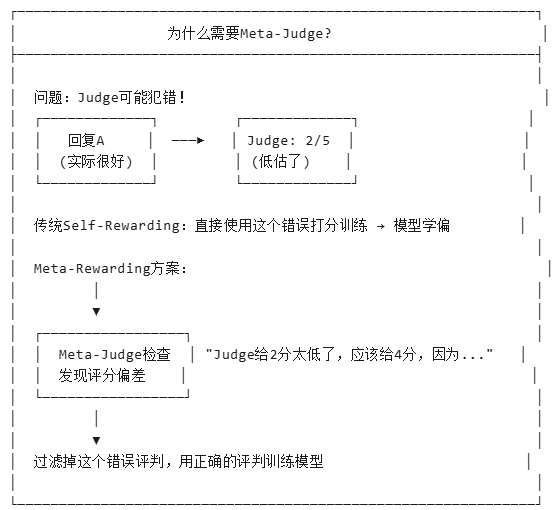

### Meta-Rewarding：引入"元评判"升级
| 角色             | 职责               | 训练数据     |
| -------------- | ---------------- | -------- |
| **Actor**      | 生成回复             | 指令遵循数据   |
| **Judge**      | 评判回复质量（0-5分）     | 评估指令数据   |
| **Meta-Judge** | 评判"Judge的评判"是否准确 | 成对评判比较数据 |
- 核心优势图解
- {:width 400 :height 300}
- 流程步骤:
- ```mermaid
  flowchart TB
      subgraph Generation["数据生成与评估"]
          direction LR
          A1[M1 Actor] -->|"生成"| A2[回复]
          A2 --> B1[M1 Judge]
          B1 -->|"打分"| B2[评分+理由]
          B2 --> C1[M1 Meta-Judge]
          C1 -->|"评判<br/>打分质量"| C2[质量评估]
      end
      C2 -.->|筛选| D[高质量评判]
      D --> E[DPO训练<br/>Actor + Judge] --> F[M2]
  ```
-
-