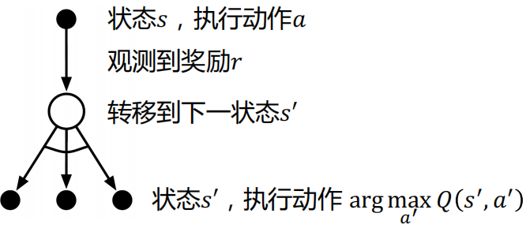
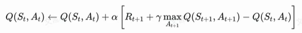
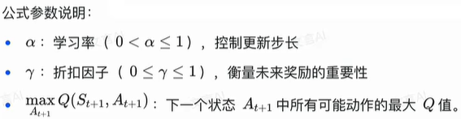

- Q:最大动作状态价值函数Q(S, A)，指在状态S,采取动作A 的最大价值
  Q-learning:学习的是Q*，进而可以根据状态选出获得最大价值的动作
   
  状态-动作价值函数更新公式：
- 
- 
-
-
- 重要思考问题：
  1）Q-learning为什么不需要重要性采样？
  Q-learning 是一种无模型的强化学习算法，它直接学习状态-动作对的值函数 Q(s,a)
  更新公式可以看出，Q-learning 是基于单步回报的更新。它直接利用当前采样到的状态和动作来更新 Q 值，而不是依赖于整个轨迹的采样。因此，它不需要考虑轨迹的采样分布问题，也就无需使用重要性采样。