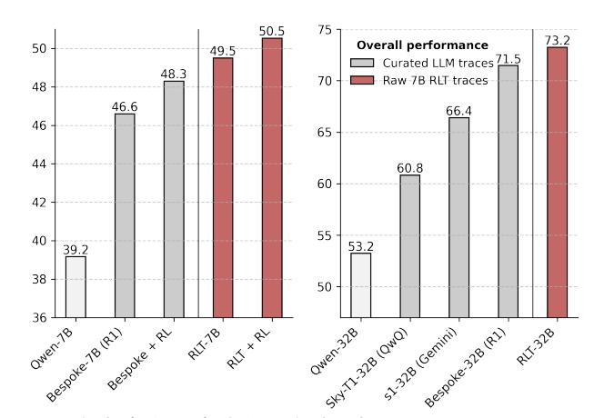
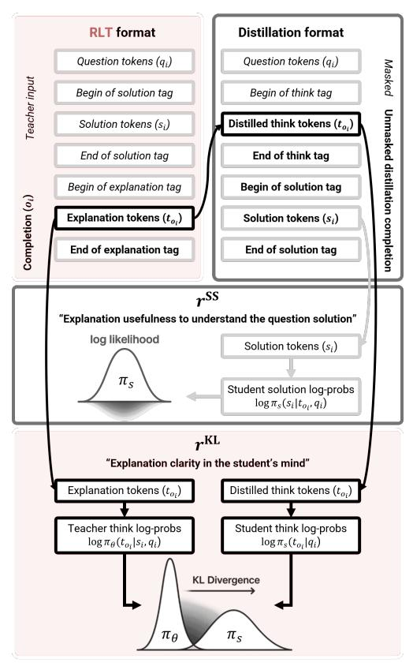
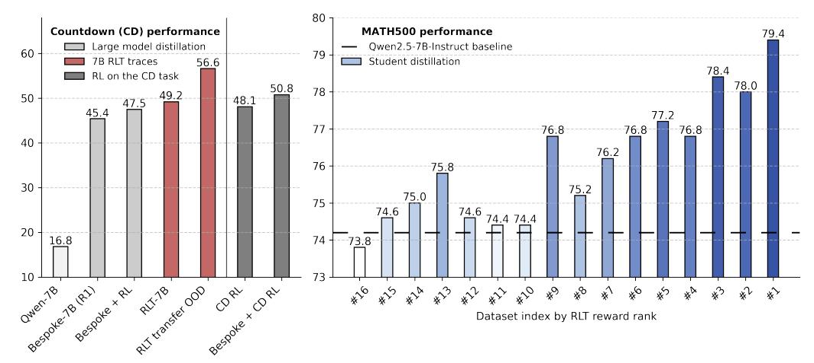
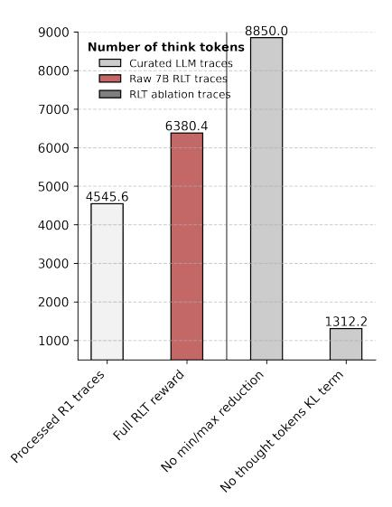

- # 强化学习中的测试时间缩放教师
- ## 摘要
  
  训练推理语言模型(LLMs)通过强化学习(RL)追求单次正确性,其本质依赖于模型在初始化阶段即具备一定概率探索并解决任务的能力。此外, 推理LLMs的一个关键应用场景是充当教师角色,用于提炼新学生模型并为后续RL迭代提供冷启动支持,而非直接部署模型本身。基于这些考量,我们提出了一种新框架,通过训练一类专注于产出最有效下游蒸馏结果的强化学习教师模型(RLTs),避免了RL固有的探索难题。RLTs被同时输入 问题及其解决方案,其任务简化为根据学生需求定制详细解释来"连接点线" 。我们通过将每份解释输入学生模型并测试其对问题解决方案的理解度, 来获取密集奖励以训练RLTs。实践表明,一个70亿参数RLT的原始输出在 竞赛及研究生级别任务上的最终表现,超越了现有依赖收集并后处理规模 大数个量级LLMs推理轨迹的蒸馏与冷启动流程。更值得注意的是,RLTs在 训练更大规模学生模型时仍保持高效,且能零样本迁移应用于分布外任务 ,为RL推理框架开启了效率与可复用性的新高度。
- github代码地址
- (https://github.com/SakanaAI/RLT)
- ## 1 引言
  
  探索是强化学习(RL)中的关键 挑战之一。稀疏奖励无法提供任何学习,除非智能体在初始化时就已具备解决给定任务的能力 。随着强化学习在开放式推理(RL reasoning)中的兴起,催生了一 种超越提示工程与搜索的新型语言 模型扩展方式，探索重新成为关键挑战。强化学习的经典动机在于其潜力——通过奖励函数引导,从局部解进行自举提升
  
  
  
  图1:在竞赛和研究生级别任务(AIME、MATH、GPQ A)中,RLT相较于规模大几个数量级的语言模型,提供了更优的学生知识蒸馏效果和强化学习冷启动性能。
  
  从零开始学习全新任务。然而,强化学习推理框架中使用的独热正确性奖励机制本质无法提供密集的指导形式,其重心仅在于强化初始模型在k次尝试通过率池中的正确答案——并未实现真正超越既有范畴的外推能力。
  
  由于这一根本性限制,加之强化学习训练的不稳定性,蒸馏技术已成为当前推理范式中另 一普遍存在的组成部分。在此情境下,经过强化学习训练的语言模型在测试阶段扮演着 *teacher*的角色,为*student*提供指导性推理轨迹以解决新问题。这种师生范式被广泛采用, 既用于训规模较小、能力较弱的模型,甚至用于冷启动后续强化学习迭代——以教师自身初始检查点作为学生起点,以实现更好终收敛效果。然而,基于正确性奖励强化的解题能力已被证明与下游蒸馏目标并不完全一致。为解决这种不匹配,当前流程极大程度依赖对教师输出进行启发式后处理,以实现有效的知识迁移。
  
  基于这些考量,我们提出了一种框架,通过训练一类新型的专业化强化学习教师(RLT)来 规避强化学习中的探索挑战,这些教师专门用于实现高效的下游知识蒸馏。我们的核心思路很简单:现实世界中教师的能力并不取决于他们能否独立构思出复杂的定理、证明或从零开始的答案,而在于他们能否利用现成解决方案为学生设计出具有启发性的解释。因此,我们 摒弃了传统强化学习的推理框架——即要求模型先思考再首次提出新解决方案的模式。相反 ,RLT的任务是解决一个更简单的问题:在问题解决方案已包含于提示的前提下,提供有效 的解释。我们采用密集奖励机制训练RLT,利用学生对教师解释中每个问题真实解决方案理 解程度的对数概率进行评估,同时衡量解释本身逻辑跳跃的可解释性。
  
  通过从参数规模为7B的轻量级RLT(强化学习教师)的原始输出中蒸馏学生模型,我们证 明了其性能显著优于依赖参数规模大数个量级的推理型语言模型的现有流程(图1)。我们 展示出,即使将RLT的解释蒸馏用于训练更大的32B学生模型及冷启动传统强化学习优化时 ,我们的框架仍能提供卓越优势。此外,我们还展示了RLT如何零样本迁移到新领域,并仍 能生成有效的蒸馏数据集,最终得到的学生模型甚至优于直接访问任务奖励进行强化学习的 结果。总体而言,这些结果凸显了我们新方法的潜力——通过专注于更强、更小且高度可复 用的专用教师模型来克服强化学习的高成本,同时摆脱当前对昂贵且启发式驱动的蒸馏流程 的依赖。
  
  我们分享了代码和预训练模型检查点,以促进强化学习推理与蒸馏领域的未来研究。简而 言之,我们的主要贡献有以下三点:
- 我们介绍RLT框架,它以更简单的密集奖励应对探索问题,使强化学习训练的目标 与提供有效的下游学生蒸馏保持一致。
- 我们展示了如何通过蒸馏7B RLT的原始输出,直接超越用经过精心后处理的、来 自规模大几个数量级的LM的推理轨迹来训练学生模型的效果。
- 我们证明,RLTs还能为传统强化学习提供更好的冷启动效果,有效地蒸馏到更大的 学生模型,甚至实现对新推理领域的零样本迁移。
- ### 2 在语言模型中诱导推理
- #### 2.1 强化学习
  
  诱导推理行为的RL后训练方法最近因DeepSeek R1系列研究[13, 14, 7]而广受欢迎。通过在带 有可验证解{s1, . . . , s<sup>N</sup> }[的问](#page-10-1)[题数](#page-10-2)[据](#page-9-7)集D = {q1, . . . , q<sup>N</sup> }上进行微调,Guo等人[7]证明了从67 1B参数量的语言模型[15]中[能涌](#page-10-3)现出有效的"推[理](#page-9-7)"行为,显著提升了其在复杂数学与编程任 务上的表现。他们的训练采用GRPO[14]实现——这[是一](#page-10-2)种在线RL算法,通过简单的蒙特卡 洛值估计取代了批评模型的使用。GRPO会促使语言模型πθ为每个抽样问题q ∈ D生成一组 G >>个"分组"输出o1, ...oG,其优化目标为:
  
  <span id="page-1-1"></span>
  $$
  J(\theta) = \mathbb{E}_{q \sim D, \{o\}_1^G \sim \pi_\theta(\cdot|q)} \left[ \frac{1}{G} \sum_{i=1}^G (A_i - \beta \mathbb{D}_{\text{KL}}(\pi_\theta \, \| \, \pi_{\text{ref}})) \right]. \tag{1}
  $$
  
  <span id="page-1-0"></span><sup>1</sup> <https://github.com/SakanaAI/RLT>
  
  <span id="page-2-0"></span>图2:左图:RL格式要求语言模型从零开始思考并解决难题。右图:RLT格式要求语言模型 在获得解决方案的情况下,生成具有指导性的逐步解释。
  
  此处,"优势"Ai是通过对每个组内各输出的奖励ri进行归一化得到的:
  
  <span id="page-2-1"></span>
  $$
  A_i = \frac{r_i - \text{mean}(\{r_1, \dots, r_G\})}{\text{std}(\{r_1, \dots, r_G\})}.
  $$
  
  他们设计中的一个关键组件是一个系统提示,要求语言模型将每个生成的输出oi分解为两个 独立格式化的部分,分别由<思考>和<解决方案>标签分隔,标记为toi和soi。通过为未格式 化的补全分配奖励r<sup>i</sup> = −1,为格式正确但内容错误的补全分配r<sup>i</sup> = −0.5,仅对格式和内容 均正确的补全给予r<sup>i</sup> =1,这一结构被强制执行。采用此策略训练后,Guo等人[7]展示了语 言模型的补全长度随着反思、验证[和自](#page-9-7)我校正步骤的出现而逐渐增长,模仿了人类的思维链 过程。
## 2.2 监督蒸馏

监督蒸馏是训练近期推理模型以弥补强化学习不足的另一关键步骤。对于如方程1这类在线 强化学习目标而言,为避免崩溃,模型初始化时就必须具[备](#page-1-1)生成正确响应的非零概率,且梯 度非零。这一本质特性使得强化学习目标的适用性远不及交叉熵目标——后者始终将正确响 应信息包含于模型梯度中。由于这种二元性,用监督学习蒸馏经强化学习训练的大语言模型 的推理轨迹,不仅成本更低,而且已被证明在小型低能模型中诱导推理能力的效果显著优于 直接进行强化学习[7, 8, 16, 11, 9]。此外,强化学习尤其容易[在](#page-9-7)[长](#page-9-5)[时间](#page-10-4)[训](#page-9-9)[练](#page-9-6)中出现不稳定性 和输出质量下降。受此第二项限制影响,DeepSeek R1与多个其他模型[7,10]通过多轮迭代实 施强化学习训练:每轮中间迭代结束时,仅利用强化学习训练模[型再](#page-9-7)[次收](#page-9-8)集蒸馏数据集,用 于"冷启动"其原始初始检查点,从而为下一轮强化学习迭代获取更强的初始化起点。

构建蒸馏提示数据集DSD = {d1, . . . , d<sup>N</sup> }涉及使用经过强化学习训练的语言模型πθ及其推理 系统提示来回答一系列可验证问题,这些问题可通过多种启发式方法选取[8, 16, 11, 9]。随 后,通过将模型对每个问题o [∼](#page-9-5) [π](#page-10-4)θ([·|](#page-9-9)q)[输](#page-9-6)出的推理轨迹与真实解决方案进行比对来筛选, 确保其正确性。通常,这些推理轨迹还会经过额外的"人工"细化步骤进行后处理,例如请其 他闭源语言模型修正语法问题,并将推理步骤重构为更清晰、一致的格式。事实上,Li等 人[11]甚至认为,思考数据的结构和格式是让较弱模型真正[理解并](#page-9-9)学习从蒸馏中推理的关键 要素,其重要性可能超过正确性本身。
## <span id="page-2-2"></span>3强化学习导师
## 3.1 将教师模型作为学生进行训练的启示

在现代推理框架中,我们区分了语言模型可以承担的两种独立训练与推理"角色"。如第2 节所述,经过强化学习训练后,语言模型{v\*}往往[不](#page-1-2)具备

部署自身,而是用来获取推理蒸馏数据集,用于微调较弱模型和冷启动未来的强化学习迭 代。因此,这些模型可以被有效地视为教师,为未来的学生模型πs提供学习所需的解释。

这种师生范式凸显了强化学习训练目标与教师在测试时角色之间的潜在不匹配。在传统设置 中,教师通过稀疏的正确性奖励进行训练,以提高其从头解决难题的能力。这一目标不仅因 固有的探索挑战,限制了强化学习训练应用于超出基础模型原始能力的任务,还与教师实际 最终目标——生成学生πs可从中学习必要技能以自行推导正确解决方案的推理轨迹——不相 吻合。基于这些考量,我们提出了一个不同的训练框架,用于部署作为教师的强化学习推理 模型,该框架规避了强化学习的探索挑战并解决了这种目标不匹配问题。我们的框架包含一 个更简单的任务表述、密集奖励目标以及精心设计的训练方案,使我们能够学习一类新型的 专门化强化学习教师(RLTs)。
#### <span id="page-3-1"></span>3.2 对齐教师模型的任务

在传统的强化学习范式中,每个问题的解si从 未明确提供给模型,仅用于检查语言模型生成 内容soi中对应解答的正确性。禁止直接访问或 了解这些解决方案的做法,使训练目标与测试 时从零开始解决全新问题的目标保持一致,但 这正是探索变得困难的原因——因为模型在首 次成功尝试之前不会接收到任何梯度信号。然 而,我们的关键发现是:对于已知答案的问题 ,若要实现生成高效蒸馏数据集DSD这一测试 阶段的"教学"目标,通过明确提供此类解决方 案的访问权限可以极大促进该过程——正如现 实世界中的教师那样,他们能够依赖现成可用 的解决方案,从而完全专注于对学生而言其解 释是否具有指导性。

为此,如图2所示,我们采用了一[种新](#page-2-0)的格式 化风格提示RLTs,将每个问题的问题与解答同 时作为输入,并要求其生成具有指导性的逐步 解释,以连接二者之间的逻辑。我们设计的提 示允许直接复用教师的输出用于学生蒸馏,同 时保持任务的自然性,即在生成每个补全前, 将解答标记si及标签附加到RLT的系统提示和 输入问题中。在测试阶段,为构建学生蒸馏数 据集d<sup>i</sup> ∈ DSD对应的问题补全,只需从教师的 输出中提取思考标记即可——



<span id="page-3-0"></span>图3:将RLT解释中的标记复制到学生格式 中,以便通过我们的奖励项衡量其理解程 度。

通过用think标签替换周围的解释并追加解决方案si来实现。
#### <span id="page-3-2"></span>3.3 评估解释的质量

训练RLT的奖励函数由两部分组成,旨在激励生成既能引导学生πs恢复正确解法si、又能在 学生视角下与问题构成逻辑连贯的解释oi。具体而言,按照前一小节的流程,我们会从教师 πθ的每个补全答案oi中提取思考标记t<sup>o</sup>i,并格式化对应的

学生蒸馏提示di通过在问题qi前添加和真实解决方案si后追加的方式生成。如图3所示,每个 蒸馏提示随后作为输入馈[送](#page-3-0)给学生模型,以获得一组每个token的对数概率,这些概率被处 理成我们的两个奖励项,具体如下:

i. r SS <sup>i</sup> :量化学生πs在给定问题qi和上下文中的思考标记toi的情况下对解决方案si的理 解。第一个奖励项是通过学生对解决方案标记的对数概率计算得出,并采用平均值和 最小值操作进行缩减:

r SS (o<sup>i</sup> , s<sup>i</sup> , qi) = avg {log π si <sup>s</sup> } + α min {log π si <sup>s</sup> } , where π si <sup>s</sup> = πs(s<sup>i</sup> | to<sup>i</sup> .qi). (3) ii. r KL <sup>i</sup> :量化思考标记toi本身是否从学生视角出发,与教师视角相比,是可解释的逻辑 延续。该第二奖励项通过计算教师分布(在RLT格式下,上下文包含qi和si)与学生分 布(上下文仅含问题qi)对相同思考标记的KL散度,并采用平均和最大化操作进行降 维:

$$
r^{\text{KL}}(o_i, s_i, q_i) = \text{avg}\left\{\mathbb{D}_{\text{KL}}\left(\pi_{\theta}^{t_{o_i}} \| \pi_s^{t_{o_i}}\right)\right\} + \alpha \max\left\{\mathbb{D}_{\text{KL}}\left(\pi_{\theta}^{t_{o_i}} \| \pi_s^{t_{o_i}}\right)\right\},\qquad(4)
$$
\n
$$
\text{where}\quad \pi_s^{t_{o_i}} = \pi_s(t_{o_i} \mid q_i),\quad \pi_{\theta}^{t_{o_i}} = \pi_{\theta}(t_{o_i} \mid s_i, q_i).
$$

最终,RLT奖励通过将这两个项与权重系数λ相结合获得:

<span id="page-4-4"></span><span id="page-4-3"></span><span id="page-4-0"></span>
$$
r_i^{\text{RLT}} = r^{\text{SS}}(o_i, s_i, q_i) - \lambda r^{\text{KL}}(o_i, s_i, q_i)
$$
\n
$$
\tag{5}
$$

我们奖励函数中的每一项都有其精确目的。首先,优化r SS将生成包含思考标记toi的解释, 这些标记能最大化学生得出正确解si的可能性。但仅凭这一项无法区分那些逐步引导学生的 解释与那些虽提高解题概率却未提供可学习逻辑路径的解释。后者的极端例子是单纯重复解 题标记以提高概率,却未能提供适用于解决新问题的通用推理方法示例。因此,引入r KL恰 好填补了这一空白,它使教师的分布向学生的分布对齐,确保输出解释中的每个思考标记在 蒸馏提示di(仅含问题qi和上下文中先前的思考标记)格式化时不会概率过低。直观上,这 一项的引入规范了教师解释所勾勒逻辑路径的每一步,使其在仅给定学生既有理解和问题本 身时,仍能在"学生思维"中保持合理。此外,结合平均与最小/最大缩减确保了奖励不会 忽略任何单个标记,无论解决方案长度或教师解释中思考标记的数量如何。例如,省略这些 可能会根据解的长度偏置r SS,或导致教师偏好冗长解释以降低r KL对困难但必要逻辑步骤的 影响。更多讨论详见附录D,我们在此对所有这些设计选择进行了实证分析与验证。
#### 3.4 整合一切:RLT训练范式

RLT框架可与任何强化学习算法(例如[17, 18])结合使用[,只](#page-10-5)[需](#page-10-6)对语言模型的调节条件和 奖励机制进行最小改动,如上文小节所述。在本工作中,我们采用了第2节详述的简单GRP O方案,从而得到以下训练目标:

$$
J^{\text{RLT}}(\theta) = \mathbb{E}_{q,s \sim D, \{\mathfrak{o}\}_{1}^{G} \sim \pi_{\theta}(\cdot | s,q)} \left[ \frac{1}{G} \sum_{i=1}^{G} \left( A_{i}^{\text{RLT}} - \beta \, \mathbb{D}_{\text{KL}}(\pi_{\theta} \, \| \, \pi_{\text{ref}}) \right) \right],\tag{6}
$$

其中ARLT <sup>i</sup> 采用方程2定义的归一化策略计算,并使用方程5中的RLT奖[励](#page-2-1)函数。与基于正确 性的奖励不同,我们[的学](#page-4-0)习信号本质上是密集的,即便在尚未掌握任何任务专业知识时,也 能为RLT的输出提供信息丰富的排序。这一根本性差异极大优化了我们的训练过程,类似于 启发式设计的奖励如何让强化学习代理学会视频游戏和机器人任务的全新行为[19, 20][。](#page-10-7)
## <span id="page-4-2"></span>4 实验

<span id="page-4-1"></span>4.1 训练、蒸馏与评估

我们在Li等人[11]根据难度级别筛选的问题与解答集上训练RLTs。该[数据](#page-9-9)集包含最初用于训 练的不足17K道数学与编程题目。

| Model                   | Data size | AIME 2024 | MATH 500 | GPQA Diamond | Overall |
|-------------------------|-----------|-----------|----------|--------------|---------|
| QwQ-32B                 | N.A.      | 50.00     | 90.60    | 54.50        | 65.03   |
| DeepSeek-R1             | 800K+     | 79.80     | 97.30    | 71.50        | 82.87   |
| Qwen2.5-7B-Instruct     | N.A.      | 10.00     | 74.20    | 33.30        | 39.17   |
| Bespoke-7B-1K           | 1K        | 13.30     | 80.00    | 33.80        | 42.37   |
| RLT-7B-1K (Ours)        | 1K        | 20.00     | 80.40    | 41.90        | 47.43   |
| Bespoke-7B              | 17K       | 20.00     | 82.00    | 37.80        | 46.60   |
| RLT-7B (Ours)           | 17K       | 23.30     | 82.80    | 42.40        | 49.50   |
| Qwen2.5-32B-Instruct    | N.A.      | 26.70     | 84.00    | 49.00        | 53.23   |
| s1-32B                  | 1K        | 50.00     | 92.60    | 56.60        | 66.40   |
| s1-32B + budget forcing | 1K        | 56.70     | 93.00    | 59.60        | 69.77   |
| Bespoke-32B-1K          | 1K        | 46.70     | 92.60    | 57.50        | 65.60   |
| RLT-32B-1K (Ours)       | 1K        | 60.00     | 94.00    | 60.10        | 71.37   |
| Sky-T1-32B              | 17K       | 43.30     | 82.40    | 56.80        | 60.83   |
| Bespoke-32B             | 17K       | 63.30     | 93.00    | 58.10        | 71.47   |
| RLT-32B (Ours)          | 17K       | 66.70     | 93.40    | 59.60        | 73.23   |

表1:不同模型规模(7B和32B)与数据量(1K和17K)下的RLTs及先验蒸馏流程。

从QwQ和DeepSeek R1收集的经过过滤和后处理的推理轨迹中提炼知识。相比之下我们考虑的RLT模型规模要小几个数量级,且均基于Qwen2.5-7B-Instruct语言模型[22]进行 训练。在强化学习阶段前,[我们](#page-10-9)进行了短暂的监督微调阶段,利用Labs[12]发布的开源推理 数据集让RLT熟悉新的[系统](#page-10-0)提示和输入格式。强化学习过程中,我们使用另一个小型Qwen-7B模型作为学生模型来计算RLT解释的奖励值。主模型训练125步(不足一个epoch),批量 大小为1024,恒定学习率为1×10<sup>−</sup>6,组大小为64。值得注意的是,我们也尝试过采用256的 较小批量进行RLT训练,并通过增加步数来加速初步实验,仅导致性能轻微下降。

我们利用学习到的RLT,从训练集的全部17K问答对中收集了蒸馏数据集。随后,基于这些 新的推理轨迹,我们继续对模型进行微调,使用的要么是完整数据集,要么是随机采样的1 K子集,以匹配蒸馏计算量预算,并遵循与基线方法[8,11]相同的方案。不同于以往的强化 学习蒸馏流程,我们未对RLT[的推](#page-9-5)[理轨](#page-9-9)迹施加额外的后处理优化来提升质量,而是直接使用 模型的原始输出来进行学生模型的微调。关于训练和蒸馏阶段的完[整超](#page-13-0)[参数](#page-14-0)列表及更多细节 ,请参阅附录A和B。

遵循先前的研究工作,我们的主要评估考虑了文献中三个流行且具有挑战性的任务:AIME24;MATH;以及GPQA Diamond问答基准(Graduate-level Google-proof Q&A)中自然科学主题的问题集。试的结果 较为接近。在附录C中,我们通过评估模型在更多任务和场景下的表现
### 4.2 教师与学生间的测试时推理

我们的主要实验旨在验证RLT在获取具有指导性推理轨迹方面的有效性,超越传统蒸馏流 程。如第4.1节所述,为构建学生蒸馏数据集,我们采用了与近期[最先](#page-4-1)进基线模型[11,12]相 同的初始[问题](#page-9-9)-[解](#page-10-0)决方案对,每个样本仅在其推理轨迹上存在差异。虽然RLT可低成本应用 于大规模语料库的解释生成,但这种一致性设计是为了排除除推理轨迹质量外的其他潜在 混杂因素,确保实验与比较的公正性。出于同样原因,我们在蒸馏阶段未调整任何超参数 ,学生模型的训练完全遵循基线方法的数据规模处理流程[11,8]。

| Model                    | Data size | AIME 2024 | MATH 500 | GPQA Diamond | Overall |
|--------------------------|-----------|-----------|----------|--------------|---------|
| Qwen2.5-7B-Instruct      | N.A.      | 10.00     | 74.20    | 33.30        | 39.17   |
| Bespoke-7B               | 17K       | 20.00     | 82.00    | 37.80        | 46.60   |
| RLT-7B (Ours)            | 17K       | 23.30     | 82.80    | 42.40        | 49.50   |
| RL no cold-start         | N.A.      | 13.30     | 74.20    | 34.80        | 40.77   |
| RL cold-start (raw) + RL | 17K       | 10.00     | 71.00    | 34.80        | 38.60   |
| RL cold-start (GPT) + RL | 17K       | 16.70     | 78.20    | 36.90        | 43.93   |
| Bespoke-7B + RL          | 17K       | 16.70     | 82.80    | 45.40        | 48.30   |
| RLT-7B + RL (Ours)       | 17K       | 26.70     | 84.00    | 40.90        | 50.53   |

<span id="page-6-0"></span>表2:冷启动传统RL的RLTs及先验蒸馏流程。

我们将RLT的解释与先前方法进行比较,评估学生模型在我们完整的17K蒸馏样本及其1K子 集上的微调效果。我们近期的基线模型均遵循相似的构建流程:通过昂贵推理模型或API调 用生成推理轨迹数据集,再用闭源语言模型进行后处理——s1[8]采用Gemini Flash Thinking[2 8]的推理轨迹,Sky-T1[11]使用QwQ[21]的轨迹,而Bespoke[12][则基](#page-9-5)于DeepSeek R1[7]的轨 迹。由于Bespo[ke](#page-10-15)基线在与[我们](#page-9-9)相同的问题-解答语料[上取得](#page-10-8)了最先进的[结果](#page-10-0),我们扩展了其 评估:仅针[对相](#page-9-7)同的1K问题子集蒸馏其处理的R1轨迹数据,使其数据点数量与其他s1基线 保持对齐。

如表1所示,我们[的](#page-5-0)小型7B参数RLT模型的原始输出解释效果优于所有考虑的数据蒸馏流程 ,这些流程涉及参数量级更大的教师模型及额外临时后处理步骤。我们还发现RLT轨迹的有 效性在不同数据规模下保持一致,这与Bespoke流程中的R1轨迹形成鲜明对比——后者在子 采样时效果显著下降。此外,即使蒸馏Qwen-32B学生模型(远大于我们的7B教师模型), 我们的RLT方法在两种数据规模下仍以显著优势超越所有现有方法。这一结果尤其表明,我 们的框架如何能克服当前强化学习推理的高昂成本:将昂贵的强化学习过程负担转移至小 型教师模型——这些模型虽无法从头有效解决问题,却高度擅长为更强大大型学生模型生成 有效解释这一更简单任务。
### <span id="page-6-1"></span>4.3 从RLT到冷启动RL

我们接下来的实验重点在于评估RLT为传统强化学习提供冷启动数据的有效性。在这一新 的强化学习阶段,我们采用相同的GRPO实现方案,沿用第2节所述的标准学生格式及基于 正确率的奖励机制。与RLT框架相比,我们发现使用更大的1024批量[尺寸](#page-1-2)能显著更好地应 对传统强化学习中方差增大和奖励稀疏的问题。我们基于Li等人[29]最新发布的强化学习数 据集进行了完整周期训练,该数据[集是](#page-11-0)通过分析竞赛数学数据中单个样本与整体性能提升 的相关性,筛选出有效子集而构建的。

我们将对比在Qwen-7B模型上执行这一新强化学习阶段的效果,该模型分别从我们7B RLT 的推理轨迹冷启动,以及从Bespoke流程后处理的R1轨迹冷启动——后者是我们最强的蒸馏 基线。此外,我们还对比了采用传统强化学习训练的7B参数基线教师模型(如先前研究[10, 7]所述):即在Qwen模型上实施两[次](#page-9-8)[强化](#page-9-7)学习,并在首次迭代结束时收集数据集来冷启动 第二次迭代。针对最后一个基线的冷启动数据集构建,我们考虑两种方案:直接采用模型 的原始输出轨迹(如RLTs的做法),或使用GPT4.1-mini[30]进行额外细化后处理,[并遵](#page-11-1)循 与其他R1及QwQ传统蒸馏流程[11,31]高度相似的策略。

如表2所示,我们[7B](#page-6-0)参数的RLT生成的推理轨迹再次展现出优于所有基线的冷启动效能。与 传统RL训练的7B教师模型采用的冷启动方法相比,性能差距尤为显著。事实上,只有通过 GPT后处理改进这些RL训练教师模型生成的轨迹格式与结构后,我们才能观察到原始Qwen-7B结果的任何提升。尽管我们的RLT同样源自同一7B模型训练,但相较于后处理的R1流程 ,它依然展现出更优越的冷启动能力。总体而言,我们认为这些结果极具说服力



<span id="page-7-0"></span>图4:左图:与使用Li等人[11]语料库训练的学生以及在倒计时任务上直接进行强化学习相 比,通过迁移RLTs生成新蒸馏数据的分布外[性能](#page-9-9)。右图:在不同蒸馏数据集上训练后的性 能,按RLT奖励排序。

有证据表明,RLT有望开辟新的关键途径,使RL推理框架民主化,超越当前对规模庞大且 闭源语言模型的过度依赖。
#### <span id="page-7-2"></span>4.4 领域外零样本迁移

与从零开始解决问题不同,我们假设为给定解决方案提供有效解释是一项任务特异性低得 多的技能。因此,在本小节中,我们评估RLTs如何在不进行任何昂贵的强化学习再训练的 情况下,应用于构建数据集并在分布外领域提炼新的专业学生模型。具体[而言](#page-11-2),我们聚焦 于经典的倒计时任务[32],要求学生模型使用基本算术运算将一组数字组合成等于给定目标 的值。我们在自动生成的16K和1K问答对的不同数据集上训练并测试模型。我们将零样本 迁移的RLT与前一小节中迁移的RLT-7B学生模型及Bespoke-7B基线模型进行比较。为了夯 实结果,我们还考虑了在倒计时任务本身上进行强化学习(CD RL),按照第4.3节描述的 相同设置,从Qwen-7B模型和冷启动的Bespoke-7B基线模型进行训练。

如图4左侧条形图所示,应用RLT蒸[馏零](#page-7-0)样本方法在倒计时任务上的表现甚至显著超过了直 接强化学习。有趣的是,直接强化学习带来的分数提升,仅比使用从原始推理问题集(不含 任何倒计时问题示例)蒸馏得到的模型略高(50.8 vs. 49.2)。此外,我们发现直接强化学 习与无强化学习的Bespoke-7B基线模型在最终解决的问题集上存在高达98.5%的重叠。这些 结果与先前分析[11,6]一致,进一步证明传统强化学习的探索挑战可能使其[优势](#page-9-9)[主](#page-9-4)要源自将 基础模型的生成分布导向长文本生成。相比之下,通过简化任务并放弃稀疏奖励,我们的R LT方法显得更为高效——它提供特定于倒计时任务的轨迹,使学生模型能够学习新知识并解 决未见问题,即使在新领域没有任何教师训练的情况下,仍能实现比直接强化学习更高的性 能提升。
### <span id="page-7-1"></span>4.5 解释性奖励分析

为分析RLT奖励函数的设计,我们首先考察轨迹奖励与学生蒸馏效果之间的关系。具体而言 ,我们利用RLT在强化学习训练前的检查点,为数据中的每个问题-解决方案对生成16个补 全结果。随后用奖励函数对所有补全进行评分,并根据每个提示的相对排名将其分组。由此 ,我们每个问题获得16组不同推理轨迹的数据集,并用于训练16个新的7B规模Qwen学生模 型。如图4右侧条形图所示,按数据集排名排序的学生表现显示出两者间的明确相关性(皮 尔逊系[数超](#page-7-0)过0.89),验证了RLT目标的有效性。值得注意的是,未经任何强化学习的7B教 师模型生成的最高排名轨迹已能实现90%的——

| <   begin of thought  >                                                                                                                                             | <   begin of explanation  >                                                                                                                                    |
|---------------------------------------------------------------------------------------------------------------------------------------------------------------------|----------------------------------------------------------------------------------------------------------------------------------------------------------------|
| $\left[  \right]$                                                                                                                                                   | l                                                                                                                                                              |
| Just to check. if I use a calculator                                                                                                                                | First, the unit circle definition                                                                                                                              |
| $[]$                                                                                                                                                                | []                                                                                                                                                             |
| Another angle (no pun intended): using the derivative                                                                                                               | Alternatively, using calculus. The derivative of                                                                                                               |
| […]                                                                                                                                                                 | IJ                                                                                                                                                             |
| Another way to check: maybe using complex numbers or other<br>identities. but I think the method is solid the final answer is<br>$\langle$ end of thought $\rangle$ | Alternatively, use complex numbers. Let me try that. Express the two<br>angles as complex numbers on the unit circle<br>$\langle$ end of explanation $\rangle$ |

<span id="page-8-0"></span>图5:示例对比了后处理R1轨迹[12]中的内容,这些内容通过我们的奖励函数[衡量](#page-10-0),被相应 的RLT解释显著改善

我们基线R1蒸馏流程[12]的性能提升表明,即使是小型模[型也](#page-10-0)已具备潜在的教导能力,这些 能力通过我们新的奖励机制和简化的任务表述得以释放。

我们还检查了通过选择RLT解释的奖励相较于基线R1蒸馏流程显著提升的样本所选取的定 性示例。如图5所示,我们发现奖励较低的R1轨迹往往试图依赖外部工具(如计算器),[并](#page-8-0) 采用可能专属于DeepSeek-V3语言模型训练数据的语言模式,例如带有简短幽默评论的句子[ 15]。而对应的RLT解释则显得更为扎[实,甚](#page-10-3)至能够加入R1未考虑的额外验证步骤来检查最 终解决方案。在附录D中,我们提供了更多示例,进一步展示我们的框架与R1轨迹在定性上 的差异,以及训练RLT时各奖[励](#page-21-0)组件间未达到适当平衡所导致的特定失败案例,例如重复和 过度冗长的解释。


| Hyperparameter name             | Value                    |  |
|---------------------------------|--------------------------|--|
| RLT training                    |                          |  |
| Fine-tuned model                | Qwen2.5-7B-instruct [22] |  |
| Number of training steps        | 125                      |  |
| Batch size                      | 1024                     |  |
| Learning rate                   | −6<br>1 × 10             |  |
| Learning rate decay             | Constant                 |  |
| Final learning rate             | −6<br>1 × 10             |  |
| Weight decay                    | 0                        |  |
| Optimizer                       | AdamW [42]               |  |
| Adam beta1                      | 0.9                      |  |
| Adam beta2                      | 0.999                    |  |
| Adam epsilon                    | 1e-8                     |  |
| Warmup steps                    | 0                        |  |
| Maximum gradient norm           | 1.0                      |  |
| Maximum generation context size | 16384                    |  |
| Generation temperature          | 0.7                      |  |
| Generation top-p                | 1.0                      |  |
| Generation top-k                | No                       |  |
| Generation min-p                | 0.0                      |  |
| Generation repetition penalty   | 1.0                      |  |
| GRPO group size                 | 64                       |  |
| GRPO β                          | 0.04                     |  |
| Reference model sync. steps     | 32                       |  |
| Reference model sync. mixup     | 0.9                      |  |
| Dtype                           | bfloat16                 |  |
| Gradient checkpointing          | true                     |  |
| RLT reward                      |                          |  |
| Student model                   | Qwen2.5-7B-instruct [22] |  |
| λ                               | 3                        |  |
| α                               | 0.01                     |  |
| Format penalty                  | -1                       |  |
## 表3:RLT训练优化与奖励的超参数列表。
## A 实现细节
## A.1 RLT训练阶段与奖励

我们的实验在单台计算节点上进行,该节点配备8块Nvidia Hopper H100 GPU、1.8TB内存以 及208颗Intel Xeon Platinum 8481C CPU。由于我们采用小型7B模型进行高效训练,该配置的 资源消耗显著低于以往依赖多节点设置的强化学习(RL)乃至监督微调(SFT)研究[8,11] 。如第4节所述,在新的RL阶段,我们基于Li等[人](#page-9-5)[\[11\]](#page-9-9)<sup>2</sup>筛选的问题与解决方[案数](#page-4-2)据集训练强 化学习教[师模](#page-9-9)[型](#page-13-1),该数据集包含不到17K个数学与编程题目,并以Apache 2.0许可证开源。 所有新教师模型均从同样采用Apache 2.0许可证开源的Qwen2.5-7B-Instruct语言模型[[22\]](#page-10-9)及Q wen系列其他模型初始化。在RL阶段之前,我们使用实验室[12]提供的示例轨迹(经新系统 提示和标签格式化处理)对预收集样本进行短期微调。这个快速低成本的训练[阶段](#page-10-0)沿用Mue nnighoff等人[8]针对1K数据子集采用的蒸馏超参数(详见附录B),但将训练[轮次](#page-9-5)翻倍,旨 在让教师[模型](#page-14-0)快速熟悉任务。

https://huggingface.co/datasets/bespokelabs/Bespoke-Stratos-17k

采用新的RLT输入格式。我们还利用本阶段结束时输出的检查点,进行了第4.5节中的相关 性分析实验。出于相同原因,同时也为了限制复现性要求,我们用于计算RLT奖励函数的轻 量级Qwen2.5-7B-instruct[22]学生模型,直接初始化自Labs[12]3在A[pach](#page-10-9)e 2.0许[可证](#page-10-0)[下](#page-14-1)提供的 检查点——该模型已熟悉其系统提示词而无需额外训练。但实验表明,RLT奖励对学生的具 体语言模型选择具有鲁棒性,即使使用我们仅用1K样本微调的自有Qwen学生模型,所得数 值仍十分接近。

我们采用简单的系数来调节RLT奖励中的各项,其中λ =3用于缩放r KL,α =0.01则同时缩 放r SS中的最小值项和r KL中的最大值项。这一选择基于使RLT奖励的每个组成部分在模型初 始输出补全中具有大致相同的预期量级。通过测试发现,小幅调整这些初始参数后整体排序 仍保持相当稳健,因此我们认为无需进行大规模参数扫描。此外,对任何未使用解释标签或 超过最大生成上下文长度的补全,我们会施加-1的惩罚,以限制训练时间并抑制过长且代价 高昂的推理轨迹。在训练过程中,我们采用自定义的GRPO实现方案,其技术规格源自Shao 等人[14]的研究,并通过整合TRL库[43]与更高效的分布式VLLM生成技术[44]进行扩展。强 化学习阶段仅[包含](#page-10-2)125个步骤(不足一个完整[周期](#page-11-13)),批量大小为1024,使用学习率恒[定为](#page-11-14)1 ×10<sup>−</sup>6的AdamW优化[器](#page-11-12)[42],分组规模为64。参考模型的同步频率为每32步一次(采用[45] 推广的方法),混合比例为0.9。对于第4.3节采用的冷启动后强[化学](#page-11-15)习阶段,我们使用相同 的GRPO实现,但采用第2节描述的标准学生格式[及基于](#page-6-1)正确性的奖励机制。唯一区别在于 ,我们仅在不足1K样本量的极小规模LIMR数据集[29]上进行了总计一个周期的[训练](#page-1-2)。表3提 供了完整的超参数列表以确保可复现性。所有实现中使用的主要库[均遵](#page-11-0)循Apache 2.0[许可](#page-13-2)协 议。
### A.2 传统推理与RLT格式

如第3.2节所述并如图2所示,RLTs采用了一种新的格式风格,将每个问题的题目和解答同时作为输入。其系统提示词要求模型输出具有指导性、详细的逐步解释,将两者之间的 逻辑关联起来。相比之下,传统用于强化学习和蒸馏训练的推理数据集格式则舍弃了每个 问题的解答信息,要求模型从零开始解决每个问题。我们在图A.2中具体对比了两种方式: 一是Li等人[11]用于传统强化学习和蒸馏的系统提示词,二是我们新设计的RLT输入格式。 如图所示,我们的提示格式设计力求对传[统推](#page-9-9)理框架[的提示](#page-14-2)词做最小改动——用思考标签替 换外围[解释,](#page-15-0)并在用户提供的输入问题后直接追加解答标记{v\*},使教师模型能在生成每 个补全内容前充分利用这些信息。这种设计还实际避免了每个问题需多次重新提示教师模 型并手动核对答案以过滤错误解答的情况。

B学生蒸馏
## B.1 推理轨迹生成

如第3和第4节所述,[我](#page-2-2)们[通过](#page-4-2)向RLTs同时输入问题题干及其解法,为蒸馏数据集中的每个 样本收集推理轨迹。此外,针对第4.3节的冷启动实验,我们还采用类似Li等人[11]的方法, 向经过RL训练的Qwen模型输入每[个问](#page-6-1)题,并使用GPT4.1[30]对输出[进行](#page-11-1)后处理来收集推理 [轨迹](#page-9-9)。表4汇总了所有数据集和设置下用于收集这些轨迹的超参数。具体而言,我们对基于 Qwen的[推](#page-17-0)理模型沿用标准生成超参数[11],这些参数与新版RL阶段在线生成参数保持一致 (详见[附录](#page-9-9)A)。主要区别在于:为下游蒸馏任务避免收集不完整轨迹,我们允许更长的最 大上下文长度——[这一](#page-13-0)调整得以实现得益于

<span id="page-14-1"></span><sup>3</sup> https://huggingface.co/bespokelabs/Bespoke-Stratos-7B

|        | ,→ |  |
|--------|----|--|
| 推理输入格式 | ,→ |  |
|        | ,→ |  |
| 系统提示   | ,→ |  |
|        | ,→ |  |

,→ ,→

<|开始|>系统 您作为助手的角色,需要通过系统化的长思考流程深入探究问题,然后提供最终精确无 误的解决方案。这要求您参与一个包含分析、总结、探索、重新评估、反思、回溯和迭 代的完整循环,以形成深思熟虑的思考过程。请将回答结构分为两个主要部分:思考与 解决方案。在思考部分,按照指定格式详细说明您的推理过程:<|思考开始|> {思考步 骤以'\n\n'分隔} <|思考结束|> 每个步骤应包含详细考量,如分析问题、总结相关发现、 头脑风暴新想法、验证当前步骤的准确性、修正错误以及回顾先前步骤。在解决方案部 分,基于思考部分中的各种尝试、探索和反思,系统地呈现您认为正确的最终解决方案 。解决方案应保持逻辑性、准确性、简洁的表达风格,并详细说明得出结论所需的必要 步骤,格式如下:<|解决方案开始|> {最终格式化、精确且清晰的解决方案} <|解决方 案结束|> 现在,请尝试按照上述指导方针解答以下问题:<|im\_end|> ,→ ,→ ,→ ,→ ,→ ,→ ,→ ,→ ,→ ,→ ,→ ,→ ,→

生成前缀

<|开始|>用户

将你的最终答案放在\boxed{}中。正整数\$a\$和\$b\$满足函数\$y=ax+5\$与\$y=3x+b\$的图 像与\$x\$轴的交点是同一个点。这些交点所有可能的\$x\$坐标之和是多少?,<sup>→</sup> ,→ ,→ \$\textbf{( A)}\ {-20}\qquad\textbf{(B)}\ {-18}\qquad\textbf{(C)}\ {-15}\qquad\textbf{(D)}\ {-12}\qq uad\textbf{(E)}\ {-8}\$<|im\_end|> ,→ <|im\_start|>assistant <|begin\_of\_thought|>

图6:传统强化学习与学生蒸馏中采用的推理输入格式示例,使用来自Li等人[11]的一道示 例问题及系统提示,先向模型提供指令以呈现逐步[推理](#page-9-9)过程,再从零开始推导出问题的解 决方案。公式记号{v\*}保持不变。

在测试时,我们不受限于训练期间因长轨迹反向传播而带来的相同内存约束。

用于训练我们所有7B学生的RLT蒸馏数据集是通过为每个问题-解决方案对生成单一补全结 果而收集的,直接将其置于学生格式中。经过初步实验,我们还发现32B学生对于超出Li等 人[11]在SFT超参数中指定的16384最大上下文长度的截断推理轨迹特别敏感,他们出于计算 效率考虑有[意限](#page-9-9)制了这一长度。因此,为避免这种不匹配可能影响我们的结果,我们仅为 每个问题-解决方案对收集最多16条推理轨迹,并选择其中长度低于16384的任意一条,否则 采用r SS进行选择。
#### RLT输入格式

系统提示

<|开始|>系统 作为助手,你的职责是在提供详细解释前先给出精确无误的解决方案,并通过完整的 工作展示系统化的思考过程。你的解释应体现如何通过分析、总结、探索、重新评估 、反思、回溯及迭代的全面循环来构建深思熟虑的思考流程。请将回复结构分为两大 板块:解决方案与解析。在解决方案部分,呈现你深思熟虑且准确回应问题的答案, 保持逻辑严密、准确简洁的表达风格,并列出达成结论的必要步骤,格式如下:<|begi n\_of\_solution|> {最终格式化后的精准清晰方案} <|end\_of\_solution|>。解析部分需详尽 阐述推理流程,采用指定格式:<|begin\_of\_explanation|> {以'\n\n'分隔步骤的说明} <|e nd\_of\_explanation|>。每个步骤需展示促成解决方案的详细考量,包括问题分析、相关 发现总结、新点子头脑风暴、当前步骤准确性验证、错误修正及历史步骤回顾。<|im\_ end|> ,<sup>→</sup> ,→ ,→ ,→ ,→ ,→ ,→ ,→ ,→ ,→ ,→ ,→ ,→ ,→ ,→ ,→ ,→ ,→ ,→ 生成前缀 <|im\_start|>用户 将你的最终答案用\boxed{}框出。正整数\$a\$和\$b\$满足函数\$y=ax+5\$与\$y=3x+b\$的图 像在\$x\$轴上相交于同一点。这些交点的所有可能\$x\$坐标之和是多少?,<sup>→</sup> ,→ ,→ \$\textbf{(A)} \ {-20}\qquad\textbf{(B)}\ {-18}\qquad\textbf{(C)}\ {-15}\qquad\textbf{(D)}\ {-12}\qquad\ textbf{(E)}\ {-8}\$<|im\_end|> ,→ <|im\_start|>assistant <|begin\_of\_solution|> ... 这些交点所 有可能的\$x\$坐标之和为\(\boxed{E}\)。,<sup>→</sup>

<|解决方案结束|>

<||>的解释开始

图7:RLT输入格式示例来自Li等人[11]的研究,通过提供每个问题的解决方案作为输入, 指导模型逐步生成分步解释。

B.2 学生蒸馏规范

我们在第4节的主要实验使用了全部训练问题集或其随机选取的1K数据子集 收集的RLT轨迹。针对这些实验的学生知识蒸馏阶段,我们分别沿用了Li等人和Muenni ghoff[等人](#page-9-5)[8]针对完整数据集和1K子集的原超参数设置。未根据新数据[重新](#page-9-9)调参的目的是试 图将用于学生知识蒸馏的推理轨迹作为比较RLT与传统推理蒸馏流程时的唯一变量。此外, 在第4.4节的实验中,我们还比较了基于{[v\\*}](#page-7-2)训练的学生模型的迁移效果。
#### 表4: RLT生成流程的超参数列表。

| Hyperparameter name                  | Value    |  |  |
|--------------------------------------|----------|--|--|
| Distillation data generation setting |          |  |  |
| Maximum generation context size      | 32764    |  |  |
| Generation temperature               | 0.7      |  |  |
| Generation top-p                     | 1.0      |  |  |
| Generation top-k                     | No       |  |  |
| Generation min-p                     | 0.0      |  |  |
| Generation repetition penalty        | 1.0      |  |  |
| Generation dtype                     | bfloat16 |  |  |
### <span id="page-17-1"></span>表5:超参数列表展示了学生蒸馏阶段在Li等人[11]问题集及倒计时数据集上的应用。

| Hyperparameter name        | Full fine-tuning             | 1K subset fine-tuning | Countdown fine-tuning |  |
|----------------------------|------------------------------|-----------------------|-----------------------|--|
| Student training           |                              |                       |                       |  |
| Distilled model            | Qwen2.5-7B/32B-instruct [22] |                       |                       |  |
| Number of training samples | 16710                        | 1000                  | 16000                 |  |
| Number of epochs           | 3.0                          | 5.0                   | 3.0                   |  |
| Batch size                 | 96                           | 16                    | 96                    |  |
| Learning rate              | −5<br>1 × 10                 | −5<br>1 × 10          | −5<br>1 × 10          |  |
| Learning rate decay        | Cosine                       | Cosine                | Cosine                |  |
| Final learning rate        | −6<br>1 × 10                 | −6<br>1 × 10          | −6<br>1 × 10          |  |
| Weight decay               | 0                            | −4<br>1 × 10          | 0                     |  |
| Optimizer                  | AdamW [42]                   | AdamW [42]            | AdamW [42]            |  |
| Adam beta1                 | 0.9                          | 0.9                   | 0.9                   |  |
| Adam beta2                 | 0.999                        | 0.95                  | 0.999                 |  |
| Adam epsilon               | −8<br>1 × 10                 | −8<br>1 × 10          | −8<br>1 × 10          |  |
| Warmup ratio               | 0.1                          | 0.05                  | 0.1                   |  |
| Maximum gradient norm      | 1.0                          | 1.0                   | 1.0                   |  |
| Dtype                      | bfloat16                     | bfloat16              | bfloat16              |  |
| Gradient checkpointing     | true                         | true                  | true                  |  |

我们最初的数据点集以及通过直接强化学习将RLT本身零样本迁移到倒计时任务[32]。在这 些实验中,我们使用了包含3或4个数字的16K自动生成的倒计时问题与解决方案对,并在获 取相应的RLT轨迹后,再次采用Li等人[11]的超参数来蒸馏学生模型。我们发现,鉴于两个 数据集规模相似,这些参数在实践中表现良好,无需[进一步](#page-9-9)调整。

我们在表5中提供了每种设置下所有蒸馏实验所使用的超参数完整列表,并着重标明了三者 间的关键差异。具体而言,这些方法的主要区别体现在训练周期数、批量大小以及优化器 参数上。这些差异反映了各数据批次的总样本量及相对方差。与相关前期研究[8,11,31]的发 现一致,我们注意到在这些小数据集上的训练成本极低,[数](#page-9-5)[小时](#page-9-9)[内即](#page-11-16)可完成。需要说明的 是,我们的强化学习阶段学习率与SFT优化最终学习率保持一致——这一简单选择在实践中 表现良好。

| Hyperparameter name             | LIMR data traditional RL | Countdown data traditional RL             |
|---------------------------------|--------------------------|-------------------------------------------|
| Traditional RL student training |                          |                                           |
| Fine-tuned model                |                          | Qwen2.5-7B-instruct [22]/Bespokes-7B [12] |
| Number of training samples      | 1389                     | 16000                                     |
| Number of epochs                | 1.0                      | 1.0                                       |
| Number of training steps        | 86                       | 250                                       |
| Batch size                      | 1024                     | 256                                       |
| Learning rate                   | −6<br>1 × 10             | −6<br>1 × 10                              |
| Learning rate decay             | Constant                 | Constant                                  |
| Final learning rate             | −6<br>1 × 10             | −6<br>1 × 10                              |
| Weight decay                    | 0                        | 0                                         |
| Optimizer                       | AdamW [42]               | AdamW [42]                                |
| Adam beta1                      | 0.9                      | 0.9                                       |
| Adam beta2                      | 0.999                    | 0.999                                     |
| Adam epsilon                    | −8<br>1 × 10             | −8<br>1 × 10                              |
| Warmup steps                    | 0                        | 0                                         |
| Maximum gradient norm           | 1.0                      | 1.0                                       |
| Maximum generation context size | 16384                    | 16384                                     |
| Generation temperature          | 0.7                      | 0.7                                       |
| Generation top-p                | 1.0                      | 1.0                                       |
| Generation top-k                | No                       | No                                        |
| Generation min-p                | 0.0                      | 0.0                                       |
| Generation repetition penalty   | 1.0                      | 1.0                                       |
| GRPO group size                 | 64                       | 64                                        |
| GRPO β                          | 0.04                     | 0.04                                      |
| Reference model sync. steps     | 32                       | 32                                        |
| Reference model sync. mixup     | 0.9                      | 0.9                                       |
| Dtype                           | bfloat16                 | bfloat16                                  |
| Gradient checkpointing          | true                     | true                                      |

<span id="page-18-0"></span>表6:针对Li等人数据集的传统强化学习超参数列表。
## B.3 学生强化学习细节

针对我们在4.3节中的冷启动实验,我们还实施并执行了一个传统强化学习训练阶段,在" 学生视角"下基于正确性奖励优化模型。这一阶段是在Qwen2.5-7B-Instruct、冷启动的Bespo ke-7B以及RLT-7B模型上进行的,使用了我们在开源LIMR数据集[29][上相](#page-11-0)同的GRPO实现。 我们沿用了RLT训练阶段的大部分超参数,批处理大小为1024,这对于应对传统强化学习中 方差增大和奖励稀疏的问题尤为重要。此外,在4.4节的分布外迁移实验中,我们也以传统 强化学习作为基线,直接从Qwen2.5-7B-Instruct模型和冷启动的Bespoke-7B模型出发,针[对](#page-7-2) 倒计时任务优化正确性。对于这一特定任务,我们发现与RLT训练不同,使用更大的批处理 规模并非绝对必要,采用256的批处理规模优化模型更多步数(总计250步)反而获得了更好 的效果。表6提供了这些任务中强化学习阶段所使用的全部蒸[馏超](#page-18-0)参数列表,其中我们着重 标明了两种设置之间的关键差异。
### 表7:RLT生成管线的学生评估超参数列表,与Li等人[11]的超参数保持一致。

| Hyperparameter name             | Value    |  |
|---------------------------------|----------|--|
| Student evaluation              |          |  |
| Maximum generation context size | 32764    |  |
| Generation temperature          | 0.7      |  |
| Generation top-p                | 1.0      |  |
| Generation top-k                | No       |  |
| Generation min-p                | 0.0      |  |
| Generation repetition penalty   | 1.0      |  |
| Generation dtype                | bfloat16 |  |

表8:跨模型(7B和32B)评估的RLT与先验蒸馏流程在编码及多语言推理基准上的表现。 总体得分通过取LCB-平均分与OlympiadBench分数的平均值计算得出。

| Model                | Data size | LCB-Average | LCB-Hard | OlympiadBench | Overall |
|----------------------|-----------|-------------|----------|---------------|---------|
| Qwen2.5-7B-Instruct  | N.A.      | 31.88       | 3.30     | 35.90         | 33.89   |
| Bespoke-7B           | 17K       | 36.10       | 1.60     | 43.30         | 39.70   |
| RLT-7B               | 17K       | 34.63       | 3.30     | 46.10         | 40.37   |
| Qwen2.5-32B-Instruct | N.A.      | 48.94       | 9.80     | 46.70         | 47.82   |
| Sky-T1-32B           | 17K       | 57.94       | 17.90    | 57.30         | 57.62   |
| Bespoke-32B          | 17K       | 71.06       | 26.20    | 60.30         | 65.68   |
| RLT-32B              | 17K       | 71.24       | 32.50    | 64.00         | 67.62   |

B.4 学生评价

如第4.1节所述,我们[的主](#page-4-1)要评估包含数学与自然科学领域的三个研究生及竞赛级别任务。 具体包括:AIME24[23]——美国数学邀请赛采用的试题集;MATH 50[0\[2](#page-10-10)4]——源自权威数 学竞赛基[准的精](#page-10-12)选问题集(由[25]筛选);以及GPQA Diamond[26]—[—研](#page-10-11)究生级[防谷](#page-10-13)歌问答 基准中自然科学领域的钻石难度问题集。此外,在附录C中,我们还将实验扩展到更具挑战 性的编程与多语言领域,具体考察[:](#page-19-0)LiveCodeBench[46]——从多个知名在线平台持续收集 的无污染编程挑战题库;以及OlympiadBench[47]——选自历年数学与物理竞赛的英汉[双语](#page-12-0) 奥赛级试题集。

我们使用基于MIT许可证的Lighteval库[27]对所有上述[基准进](#page-10-14)行评估。在所有结果中,我们 报告了每位学生针对单次生成答案的完成准确率,这与先前研究[8,11,12]的汇报方式一致。 此外,为确保一致性,我们复用基准模型[31]提供的[任](#page-9-5)[务实](#page-9-9)[现代](#page-10-0)码(包含系统提示词),该 代码基于Apa[che](#page-11-16) 2.0许可证发布。出于同样原因,我们未修改其评估建议配置中的任何现有 生成超参数,具体参数见表7。
## <span id="page-19-0"></span>C 额外实验
#### C.1 编码与多语言推理

我们将主要实验从第4节扩展,聚焦于数学与自[然科](#page-4-2)学领域的研究生及竞赛级别任务,比较 7B参数RLT生成的推理轨迹与传统蒸馏流程的效果差异。针对与训练及蒸馏问题集契合度 较低的挑战性编程及多语言领域,我们也进行了深入考察。公式标记{v\*}保持不变。



<span id="page-20-0"></span>图8:在RLT奖励函数中消融若干关键组件后,我们的基线R1流程、7B RLT模型及其他7B 教师模型生成的推理轨迹中平均思考标记数。

被采用。具体而言,这些新基准包括LiveCodeBench(LCB)[46]——一[套无](#page-12-0)污染编码挑战问 题集,持续从多个知名在线托管平台收集,涵盖三个难度等级;以及OlympiadBench[47]—— 一组来自历年数学和物理竞赛的奥林匹克级双语问题(英[文与](#page-12-1)中文)。

在表8中我们对比了基线模型的报告结果与使用7B RLT追踪数据微调后的学生模型 表现。同时,我们重新采集了Qwen2.5-7B-Instruct模型及基于后处理R1追踪数据微调的Besp oke-7B基线模型在OlympiadBench上的性能数据,因这些结果在先前工作的参考数据中被遗 漏。对于LiveCodeBench,我们不仅报告了模型在"困难"难度题目集上的表现,还提供了加 权平均性能——该指标通过将模型在"简单"、"中等"、"困难"三级题目集中的表现按题目数 量占比加权计算得出。

我们发现,RLT蒸馏学生在这些新任务上的表现与第4节实验中的表现一致。特别是,整体 性能超越了使用规模大几个数量级的基线蒸馏流程在所有学生模型尺寸上的表现。此外,R LT在各项单独设置中的表现也最为优异,唯一例外是在7B模型上仅以微弱差距位居第二的L CB-average指标。然而,如第4.4节实验所示,通过均衡执行蒸馏的初始问题池,我们认为 这些实验可能仍未能充分体现RLT零[样本可](#page-7-2)迁移性带来的真正潜力。具体而言,迁移RLT本 身(而非其学生模型)来构建推理轨迹、纳入更多编程和中文问题,可使下游蒸馏过程进一 步发展特定领域专业知识和推理能力,而无需运行依赖大型闭源模型的高成本流程。

D 扩展分析
### D.1 RLT奖励与R1轨迹分析

我们分析了在第3.3节中描述的RLT奖励函数各组件被剔除后的实证影响。特别地,我们重 点关注移除设计中两个关键组件所产生的效应。首先,我们考察剔除思考标记的KL奖励r KL ,量化从学生视角看,思考标记t<sup>o</sup>i本身是否构成与教师相比可解释的逻辑延续。其次,我们 研究剔除最小/最大缩减项的影响,这些术语旨在确保奖励不会忽略任何单个标记,从而避 免因解决方案长度或教师解释中思考标记的数量而在奖励值中引入偏差。

<span id="page-21-0"></span>表9:在我们主要具有挑战性的推理任务集上,与RLTs及先前蒸馏流程相比,去除各奖励组 件后的教师模型表现。

| Model                     | Data size | AIME 2024 | MATH 500 | GPQA Diamond | Overall |
|---------------------------|-----------|-----------|----------|--------------|---------|
| Qwen2.5-7B-Instruct       | N.A.      | 10.00     | 74.20    | 33.30        | 39.17   |
| Bespoke-7B (R1 traces)    | 17K       | 20.00     | 82.00    | 37.80        | 46.60   |
| Full RLT reward           | 17K       | 23.30     | 82.80    | 42.40        | 49.50   |
| No thought tokens KL term | 17K       | 6.70      | 63.80    | 31.80        | 34.10   |
| No min/max reduction      | 17K       | 23.30     | 79.00    | 40.00        | 47.43   |

Postprocessed R1 reasoning distillation example Masked distillation input <|im\_start|>system <|im\_start|>system Your role as an assistant involves thoroughly exploring questions... <|im\_start|>user Generate an executable Python function generated from the given prompt... <|im\_end|> <|im\_start|>assistant Distillation reasoning trace <|begin\_of\_thought|> Okay, let's see. The problem is to find the minimum number of sheets needed to print N pages double-sided. Each sheet can hold two pages. So, I ,→ need to figure out how to calculate this based on N. Hmm, let's think about some examples. Like the sample input is 5, output is 3. Because 5 divided by 2 is 2.5, which rounds up to 3. So maybe the ,→ general formula is to divide N by 2 and round up. Wait, but wait. Let me check another example. Suppose N is 4. Then 4/2 is exactly 2 sheets. That makes sense. If N is 1, then 1/2 is 0.5, which ,→ rounds up to 1. So that's correct. So the formula is simply ceiling(N / 2). But how to compute that in Python. In Python, if you do integer division with //, but when you need to round up, you can do (N + 1) // 2. Let's see. For N=5: (5 +1)//2 =6//2=3. Correct. For N=4: (4+1)/2=5/2=2.5, integer division gives 2. Wait, no. Wait, 5//2 in Python is 2. So (4+1)//2 is 5//2=2. Which is correct. For N=1: (1+1)//2=1. Correct. So yes, the formula is (N +1) // 2. ,→,→ So the function is straightforward. Take the input N, compute (N +1)//2, and output it. Testing the sample input: input 5. (5+1)//2=6//2=3. Correct. Another test case: N=1 → 1. N=2 → 1. N=3 →2. All correct. So the code would be something like: Read N from input, compute (N+1)//2, print the result. So the Python code would be: n = int(input()) print( (n +1) // 2 ) But wait, perhaps there's an edge case. Let's see. For N=0? But according to constraints, N is at least 1, so no problem. Yes, so that's the solution. The code is simple. Just read N, calculate (N +1)//2, print. <|end\_of\_thought|> Distillation solution <|begin\_of\_solution|> To solve this problem, we need to determine the minimum number of sheets of paper required to print a document with N pages using double-sided ,→ printing, where each sheet can hold two pages. ### Approach The key insight here is that each sheet of paper can hold two pages. Therefore, the minimum number of sheets required is determined by dividing the number of pages by 2 and rounding up to the nearest integer. This can be efficiently computed using integer arithmetic by adding 1 to the number of pages before performing integer division by 2. This approach works because it effectively rounds up the result of dividing N by 2. ,→,→,→ ### Solution Code ```python n = int(input()) print((n + 1) // 2) ``` ### Explanation 1. \*\*Reading Input\*\*: The input is read as an integer N, which represents the number of pages. 2. \*\*Calculation\*\*: The formula `(N + 1) // 2` is used to compute the minimum number of sheets. Adding 1 to N before division ensures that any ,→ remainder from the division results in rounding up to the next whole number. 3. \*\*Output\*\*: The result is printed, which is the minimum number of sheets needed. This approach efficiently computes the result in constant time, O(1), making it very efficient even for the upper constraint limit. <|end\_of\_solution|><|im\_end|>

<span id="page-21-1"></span>图9:使用Bespoke数据集[12]中经过后处理的DeepSeek R1推理轨迹生成的完整格式化蒸馏 数据样本。

在这些实验中,我们完全按照表3的超参数训练全新的7B RLT模型,但分别针对思维[标记](#page-13-2)的 KL奖励和最小/最大缩减[消融](#page-4-0)实验,将λ =设为0([参见](#page-4-3)[公式](#page-4-4)5)或α =设为0(参见公式4和3 )。随后,我们构建学生蒸馏数据集,使用的起始问题-解决方案配对全集与我们主要第4节 实验中所考虑的近期最先进基线[11, 12]相同。我们将生成的消融教师蒸馏后的数[据集](#page-9-9)[及学](#page-10-0) 生模型,与采用完整RLT奖[励训](#page-4-2)练的原始7B RLT,以及使用后处理R1推理轨迹[11, 12]的最 强蒸馏基线进行对比。

| Raw 7B RLT distillation example                                                                                                                                                                                                                                                                                                                                                                                                                                                   |
|-----------------------------------------------------------------------------------------------------------------------------------------------------------------------------------------------------------------------------------------------------------------------------------------------------------------------------------------------------------------------------------------------------------------------------------------------------------------------------------|
| Masked distillation input                                                                                                                                                                                                                                                                                                                                                                                                                                                         |
| < im_start >system<br>< im_start >system<br>Your role as an assistant involves thoroughly exploring questions<br>< im_start >user<br>Generate an executable Python function generated from the given prompt<br>< im_end ><br>< im_start >assistant                                                                                                                                                                                                                                |
| Distillation reasoning trace                                                                                                                                                                                                                                                                                                                                                                                                                                                      |
| < begin_of_thought >                                                                                                                                                                                                                                                                                                                                                                                                                                                              |
| Okay, let's see. The problem is to find the minimum number of sheets needed to print N pages double-sided. Each sheet can hold two pages. So, I<br>,→ need to figure out how to calculate this based on N.                                                                                                                                                                                                                                                                        |
| Hmm, let's think about some examples. Like the sample input is 5, output is 3. Because 5 divided by 2 is 2.5, which rounds up to 3. So maybe the<br>,→ general formula is to divide N by 2 and round up.                                                                                                                                                                                                                                                                          |
| Wait, but wait. Let me check another example. Suppose N is 4. Then 4/2 is exactly 2 sheets. That makes sense. If N is 1, then 1/2 is 0.5, which<br>,→ rounds up to 1. So that's correct.                                                                                                                                                                                                                                                                                          |
| So the formula is simply ceiling(N / 2). But how to compute that in Python.                                                                                                                                                                                                                                                                                                                                                                                                       |
| In Python, if you do integer division with //, but when you need to round up, you can do (N + 1) // 2. Let's see. For N=5: (5 +1)//2 =6//2=3.<br>Correct. For N=4: (4+1)/2=5/2=2.5, integer division gives 2. Wait, no. Wait, 5//2 in Python is 2. So (4+1)//2 is 5//2=2. Which is correct.<br>,→,→<br>For N=1: (1+1)//2=1. Correct. So yes, the formula is (N +1) // 2.                                                                                                          |
| So the function is straightforward. Take the input N, compute (N +1)//2, and output it.                                                                                                                                                                                                                                                                                                                                                                                           |
| Testing the sample input: input 5. (5+1)//2=6//2=3. Correct.                                                                                                                                                                                                                                                                                                                                                                                                                      |
| Another test case: N=1 → 1. N=2 → 1. N=3 →2. All correct.                                                                                                                                                                                                                                                                                                                                                                                                                         |
| So the code would be something like:                                                                                                                                                                                                                                                                                                                                                                                                                                              |
| Read N from input, compute (N+1)//2, print the result.                                                                                                                                                                                                                                                                                                                                                                                                                            |
| So the Python code would be:                                                                                                                                                                                                                                                                                                                                                                                                                                                      |
| n = int(input())<br>print( (n +1) // 2 )                                                                                                                                                                                                                                                                                                                                                                                                                                          |
| But wait, perhaps there's an edge case. Let's see. For N=0? But according to constraints, N is at least 1, so no problem.                                                                                                                                                                                                                                                                                                                                                         |
| Yes, so that's the solution. The code is simple. Just read N, calculate (N +1)//2, print.                                                                                                                                                                                                                                                                                                                                                                                         |
| < end_of_thought >                                                                                                                                                                                                                                                                                                                                                                                                                                                                |
| Distillation solution                                                                                                                                                                                                                                                                                                                                                                                                                                                             |
| < begin_of_solution >                                                                                                                                                                                                                                                                                                                                                                                                                                                             |
| To solve this problem, we need to determine the minimum number of sheets of paper required to print a document with N pages using double-sided<br>,→ printing, where each sheet can hold two pages.                                                                                                                                                                                                                                                                               |
| ### Approach<br>The key insight here is that each sheet of paper can hold two pages. Therefore, the minimum number of sheets required is determined by dividing<br>the number of pages by 2 and rounding up to the nearest integer. This can be efficiently computed using integer arithmetic by adding 1 to<br>,→,→<br>the number of pages before performing integer division by 2. This approach works because it effectively rounds up the result of dividing N<br>,→<br>by 2. |
| ### Solution Code<br>```python<br>n = int(input())<br>print((n + 1) // 2)<br>```                                                                                                                                                                                                                                                                                                                                                                                                  |
| ### Explanation<br>1. **Reading Input**: The input is read as an integer N, which represents the number of pages.<br>2. **Calculation**: The formula `(N + 1) // 2` is used to compute the minimum number of sheets. Adding 1 to N before division ensures that any<br>,→ remainder from the division results in rounding up to the next whole number.<br>3. **Output**: The result is printed, which is the minimum number of sheets needed.                                     |
| This approach efficiently computes the result in constant time, O(1), making it very efficient even for the upper constraint limit.                                                                                                                                                                                                                                                                                                                                               |
| < end_of_solution >< im_end >                                                                                                                                                                                                                                                                                                                                                                                                                                                     |
## <span id="page-22-0"></span>图10:使用我们7B RLT模型的原始推理轨迹生成的完整格式化蒸馏数据样本。

首先,我们重点分析这些消融操作对推理轨迹内容的影响,并与原始RLT轨迹及后处理R1 流程进行对比。如图8所示,消融操作显著改变了推理轨迹的长度。使用[完整](#page-20-0)奖励的原始RL T时,生成的推理轨迹平均长度比Bespoke数据集中人工整理的R1轨迹高出39%[12]。这一结 果与第4.5节的分析一致,图9和[图](#page-10-0)10的完整案例进一步表明:我们的7B RLT常包含[传统流](#page-7-1)程 未考虑的替代验证步骤和方法,这些传统流程并未直[接](#page-21-1)针[对下](#page-22-0)游蒸馏进行优化。此外,对奖 励函数中各项的消融会导致第3.3节所述的具体不良效应,使得RL优化过程寻找最大化r RLT 的"捷径",从而损害推理轨迹质量。特别是当去除[思维](#page-3-2)标记KL奖励r KL时,我们的RLT无法 区分逐步引导学生的解释与仅提高解决方案概率(但缺乏可学习逻辑路径)的解释。如图11 所示,该消融导致教师模型在解释中仅学会重复解决方案标记本身,利用预训练学生语言模 型的重复倾向,其输出推理轨迹的平均长度急剧[下降](#page-23-0)。再者,在消融最小/最大奖励削减项 时,奖励机制实质上受推理轨迹长度偏置,致使教师模型偏好冗长解释,只为削弱必要但困 难的单个逻辑步骤对r KL的影响。其后果是......

| Thought tokens KL reward ablation distillation example                                                                                                                                                                                                                                                                                                                                                                                                                            |
|-----------------------------------------------------------------------------------------------------------------------------------------------------------------------------------------------------------------------------------------------------------------------------------------------------------------------------------------------------------------------------------------------------------------------------------------------------------------------------------|
| Masked distillation input                                                                                                                                                                                                                                                                                                                                                                                                                                                         |
| < im_start >system<br>< im_start >system<br>Your role as an assistant involves thoroughly exploring questions<br>< im_start >user<br>Generate an executable Python function generated from the given prompt<br>< im_end ><br>< im_start >assistant                                                                                                                                                                                                                                |
| Distillation reasoning trace                                                                                                                                                                                                                                                                                                                                                                                                                                                      |
| < begin_of_thought >                                                                                                                                                                                                                                                                                                                                                                                                                                                              |
| To solve this problem, we need to determine the minimum number of sheets of paper required to print a document with N pages using double-sided<br>,→ printing, where each sheet can hold two pages.                                                                                                                                                                                                                                                                               |
| ### Approach<br>The key insight here is that each sheet of paper can hold two pages. Therefore, the minimum number of sheets required is determined by dividing<br>the number of pages by 2 and rounding up to the nearest integer. This can be efficiently computed using integer arithmetic by adding 1 to<br>,→,→<br>the number of pages before performing integer division by 2. This approach works because it effectively rounds up the result of dividing N<br>,→<br>by 2. |
| ### Solution Code<br>```python<br>n = int(input())<br>print((n + 1) // 2)<br>```                                                                                                                                                                                                                                                                                                                                                                                                  |
| ### Explanation<br>1. **Reading Input**: The input is read as an integer N, which represents the number of pages.<br>2. **Calculation**: The formula `(N + 1) // 2` is used to compute the minimum number of sheets. Adding 1 to N before division ensures that any<br>,→ remainder from the division results in rounding up to the next whole number.<br>3. **Output**: The result is printed, which is the minimum number of sheets needed.                                     |
| This approach efficiently computes the result in constant time, O(1), making it very efficient even for the upper constraint limit.                                                                                                                                                                                                                                                                                                                                               |
| < end_of_thought >                                                                                                                                                                                                                                                                                                                                                                                                                                                                |
| Distillation solution                                                                                                                                                                                                                                                                                                                                                                                                                                                             |
| < begin_of_solution >                                                                                                                                                                                                                                                                                                                                                                                                                                                             |
| To solve this problem, we need to determine the minimum number of sheets of paper required to print a document with N pages using double-sided<br>,→ printing, where each sheet can hold two pages.                                                                                                                                                                                                                                                                               |
| ### Approach<br>The key insight here is that each sheet of paper can hold two pages. Therefore, the minimum number of sheets required is determined by dividing<br>the number of pages by 2 and rounding up to the nearest integer. This can be efficiently computed using integer arithmetic by adding 1 to<br>,→,→<br>the number of pages before performing integer division by 2. This approach works because it effectively rounds up the result of dividing N<br>,→<br>by 2. |
| ### Solution Code<br>```python<br>n = int(input())<br>print((n + 1) // 2)<br>```                                                                                                                                                                                                                                                                                                                                                                                                  |
| ### Explanation<br>1. **Reading Input**: The input is read as an integer N, which represents the number of pages.<br>2. **Calculation**: The formula `(N + 1) // 2` is used to compute the minimum number of sheets. Adding 1 to N before division ensures that any<br>,→ remainder from the division results in rounding up to the next whole number.<br>3. **Output**: The result is printed, which is the minimum number of sheets needed.                                     |
| This approach efficiently computes the result in constant time, O(1), making it very efficient even for the upper constraint limit.                                                                                                                                                                                                                                                                                                                                               |
| < end_of_solution >< im_end >                                                                                                                                                                                                                                                                                                                                                                                                                                                     |
|                                                                                                                                                                                                                                                                                                                                                                                                                                                                                   |

图11:完整格式化的蒸馏数据样本,采用在训练我们的教师模型后收集的推理轨迹,模从思想标记的KL奖励r KL中剥离,如公式5中定义的RLT奖励所示。

由于这种偏差,教师在推理轨迹中平均思考标记的数量几乎比后处理的R1轨迹翻了一番, 如图12所示,随着学习的深入,这些轨迹的始包含许多额外不必要的步骤,这些步 骤在语义上只是彼此重复。

接着,我们还量化并比较了各项消融措施对下游学生模型性能的影响。如表9所示,完全移 除思维标记KL奖励带来的破坏性影响直接体现在学习后学生模型的能力上——其性能甚至 低于它们所微调的原版Qwen-7B模型。这一结果验证了我们的奖励设计,表明从学生自身视 角出发,规范推理轨迹使其成为"自然"延续,对实现高效蒸馏至关重要。另一方面,移除最 小/最大奖励削减项仅导致性能适度下降,此时7B教师模型生成的新输出轨迹仍显著优于我 们使用参数规模大数个量级的R1语言模型的最强基线流程。但值得注意的是,通过最小/最 大削减项防止推理轨迹长度增长,我们的完整RLT奖励机制还实现了更快的训练速度、蒸馏 数据集生成和学生模型微调,这些实质性优势有效提升了框架的整体效率。

E 局限性与未来影响

E.1 局限性与未探索方向

这项工作的目的是引入一类新的强化学习教师模型,旨在规避稀疏奖励带来的探索挑战, 并优化经过强化学习训练的语言模型的调整过程。

在下游蒸馏的测试时间目标驱动下。然而,仍存在若干局限与改进空间,我们期待未来扩 展工作中能加以解决。首先,RLT框架依赖真实解决方案来生成解释。因此,当应用于某 些数据集和领域时,若无法获取这类信息或不实际通过查询语言模型来恢复,小型RLT模 型可能仍需依赖更大模型,尽管依赖程度低于现有蒸馏流程。如第4.1节与附录A所述,当 前训练方案并非完全基于强化学习——初始阶段需让小模型[熟悉新](#page-4-1)的教学格式[和角](#page-13-0)色,这又 需要一定程度预先收集的可用于训练的逻辑样例。我们还注意到,RLT训练使用额外的学 生模型计算奖励。但实践中发现其负面影响极小:通过简单的参数卸载可消除反向传播期 间该模型占用GPU内存的负担,且实际训练时间主要消耗(> 90%)于我们计算配置下的长上 下文自回归生成过程。

如第6节所述,我们探究共享教师与学生角色于同一优化模型的潜力,也未尝试两者的 并行训练。这留下了两个尚未解答的开放性问题:两种角色间能否实现有效知识迁移,通过 利用其目标关联性来提升训练效率;以及强化学习能否设计出适应学生特定学习动态的在线 课程。此外,由于算力限制,我们不得不在强化学习训练和学生蒸馏阶段将最大上下文长度 限制为16384,仅为基于Qwen模型可用最大上下文的一半。同样受此限制,所考虑的强化学 习训练器(RLTs)仅包含小型经济的70亿参数模型,未进一步探索扩展规模。突破这些约 束,自然成为未来改进框架能力的重要方向。最后,本研究未扩展用于获取蒸馏数据集的初 始问答对数量与广度,仅沿用先前工作中采用的高成本流程所涉及的有限样本。这使得我们 方法另一关键特性的潜在优势尚未显现——借助小型70亿参数的RLT,或许能以极低成本收 集与学生蒸馏相匹配的数据,其规模与效能可对标如Guo等[7]采用的闭源尖端数据源。
### E.2 更广泛的影响

我们的工作引入了一类新型模型,使小型语言模型能够生成比以往更昂贵流程更优质的合 成蒸馏数据集。这项研究并非旨在开发新应用,其贡献本质上是基础性的,因此更广泛的 影响必然体现在提升大型语言模型能力与普及其训练上。随着语言模型可及性与能力的增 强,它们被滥用于潜在有害目标的风险也在上升,例如影响公众舆论或获取敏感信息。此 外,随着需求增长,语言模型的碳足迹及其潜在社会影响可能日益凸显。但我们认为,当 前这些风险被推动人工智能领域发展的潜在益处所抵消,例如助力人类更好地应对未来环 境与经济挑战。
#### Min/max reduction reward ablation distillation example

Distillation reasoning trace

<|begin\_of\_thought|>

Okay, I need to solve this problem where Takahashi wants to print N pages double-sided, with each sheet holding two pages. The task is to find ,→ the minimum number of sheets required. Let's think through this step by step. So, the problem is about packing pages into sheets. Each sheet can have two pages. But since it's double-sided, maybe the way the pages are arranged affects how they fit. Wait, no, double-sided printing just means that two pages are printed on the same sheet, front and back. So for example, if I have page 1 on the front and page 2 on the back, that's one sheet. But if there's an odd number of pages, the last sheet will have only one page. For example, if N is 5, then the sample input shows 3 sheets. Let's see: 1-2 on first sheet, 3-4 on second, 5 on third. So each sheet except possibly the last can have two pages. ,→,→,→,→ Hmm, so the approach is to calculate how many pairs we can make. For N pages, the number of pairs is N//2. But if N is odd, there's an extra ,→ page. So the total number of sheets would be (N // 2) + (1 if N % Wait, but wait. Let's check another example. If N is 4. Then 4//2 is 2, and 4% Another example: N=3. 3//2 is 1, 3% What about N=1? Then 1//2 is 0, 1% Wait, the problem says each sheet can hold two pages. So if there's an odd number of pages, the last sheet has one page. But the problem's sample input is 5, which works out to 3 sheets. So maybe when N is odd, the formula is (N+1)//2. Wait, 5+1 is 6, 6//2 is 3. Which is correct. For N=3, 3+1=4, 4//2=2. Correct. For N=1, 1+1=2, 2//2=1. So that's correct. Wait, 1+1=2, 2//2=1. So the formula is (N + 1) // 2. Let's test that. ,→,→,→ Wait, for N=1: (1+1)//2 = 1. Which is correct. For N=2: (2+1)/2=1.5, integer division is 1. Which is correct. For N=3: (3+1)/2=2. Correct. N=4: ,→ 5//2=2.5→2. Correct. N=5: 3. Correct. So this formula seems to work. Wait, but wait. Let's see. For N=1, if we use (N+1)//2, that's (1+1)//2=1. So yes. So the formula is (N +1)//2. But wait, in the problem statement, the sample input 5 gives output 3, which is (5+1)//2=3. So that's correct. So the formula is (N +1)//2. Because adding 1 gives even number of pages, which can be divided by 2, and then integer division by 2 gives the correct number of sheets. ,→,→ Wait, but let me think again. For N=1, the formula gives 1. So that's correct. For N=2, (2+1)//2=1.5→1. Which is correct. So yes, this formula ,→ works. Wait, but why would (N+1)//2 be the correct formula? Because when you have N pages, each sheet holds two pages, except possibly the last one. So the total number of sheets is the number of pairs (each pair is two pages) plus one if there's an odd number. So the number of pairs is N//2, and if N is odd, there's an extra sheet. So the total is (N//2) + (1 if N % ,→,→ Yes. Because for N even, (N+1)/2 is (N/2) +0.5 → but integer division would be N/2. For example, N=4: (4+1)/2=2.5→2. Which is correct. For N=5: ,→ (5+1)/2=3. So that's correct. So the formula is (N +1) // 2. Wait, but wait. Let's test N=1. (1+1)/2=1. Correct. N=2: (2+1)/2=1.5→1. Correct. N=3: (3+1)/2=2. Correct. N=4: 2. Correct. N=5:3. Correct. So this formula works. So the problem reduces to calculating (N + 1) // 2. But wait, the input is N, which is between 1 and 100. So the function needs to read N from standard input, compute (N+1)//2, and output that. Wait, but wait. Let's take N=1. The sample input is 5, which gives output 3. For N=1, the output would be 1. But according to the problem statement, the minimal number of sheets. So for N=1, you need 1 sheet. Because even though you can't fill a full sheet, you just have to use one sheet. So the formula works. ,→,→ So the code is straightforward. Read N, compute (N+1)//2, print that. Wait, but let me check another example. Let's say N=6. (6+1)//2=3.5→3. Wait, 6//2=3. Correct. So that's correct. Wait, but wait. Wait, no. Wait, (6+1)//2 is 7//2=3. Wait, 7 divided by 2 is 3.5, integer division is 3. So (6+1)//2 is 3.5 →3. So yes. So 6 ,→ pages would require 3 sheets. Each sheet has two pages. So 1-2, 3-4, 5-6. So three sheets. Correct. So the code is as simple as reading N, then compute the ceiling of N divided by 2. Which is (N +1)//2. So the Python function would be: Read N from input. Then compute (N +1) // 2. Print that result. Wait, but wait. Let's test N=1 again. (1+1)//2=1. Correct. Yes. So the code is straightforward. So the code would be: Read N as integer from input. Then print (N + 1) // 2. But wait, wait. Let's check N=1. (1+1)//2=1. Correct. For N=2: (2+1)//2=1. So 1 sheet. Which is correct. For N=3: 2 sheets. Correct. For N=4: 2. ,→ Correct. For N=5:3. Correct. For N=6:3. Correct. So the code is correct. Therefore, the Python function is: Read N from input, then compute (N +1) // 2 and print it. So the code would be: n = int(input()) print((n + 1) // 2) Wait, but wait. Let me think again. For N=1, the answer is 1. For N=2, 1. So that's correct. So the code is correct. But wait, the problem says that N is the number of pages. So that's correct. So the code is as simple as that. I think that's it. So the answer is to compute (N +1) // 2. <|end\_of\_thought|> Distillation solution <|begin\_of\_solution|> To solve this problem, we need to determine the minimum number of sheets of paper required to print a document with N pages using double-sided ,→ printing, where each sheet can hold two pages. ### Approach The key insight here is that each sheet of paper can hold two pages. Therefore, the minimum number of sheets required is determined by dividing the number of pages by 2 and rounding up to the nearest integer. This can be efficiently computed using integer arithmetic by adding 1 to the number of pages before performing integer division by 2. This approach works because it effectively rounds up the result of dividing N by 2. ,→,→,→ ### Solution Code ```python n = int(input()) print((n + 1) // 2) ``` ### Explanation 1. \*\*Reading Input\*\*: The input is read as an integer N, which represents the number of pages. 2. \*\*Calculation\*\*: The formula `(N + 1) // 2` is used to compute the minimum number of sheets. Adding 1 to N before division ensures that any ,→ remainder from the division results in rounding up to the next whole number. 3. \*\*Output\*\*: The result is printed, which is the minimum number of sheets needed. This approach efficiently computes the result in constant time, O(1), making it very efficient even for the upper constraint limit. <|end\_of\_solution|><|im\_end|>

图12:完整格式化的蒸馏数据样本,使用从训练后的教师模型中收集的推理轨迹,该模型 在RLT奖励组件(定义于公式4和3)中移除了最小/最大缩减项。系统提示和助手消息因篇 幅原因省[略](#page-4-3)。