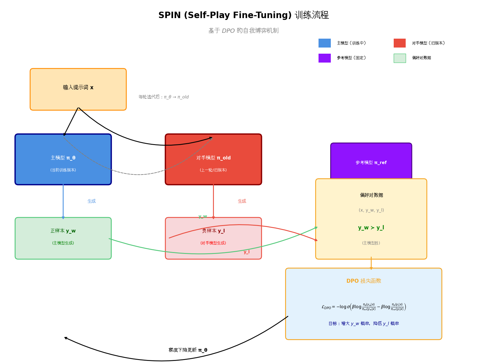
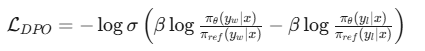

- #### SPIN 核心思想
  SPIN 是一种无需人工标注数据的 LLM 微调方法，**核心创新在于让模型通过自我博弈的方式生成训练数据并自我改进**。它解决了传统监督微调（SFT）需要大量高质量人工标注数据的问题。
-
- #### 工作原理-自我博弈框架:
  SPIN 将微调过程建模为一个两人博弈游戏：
  -a)主模型（Main Model）当前正在训练的模型，目标是生成高质量响应
  -b)对手模型（Opponent Model）通常是主模型的旧版本或副本，生成"较差"的响应作为负样本
- -c)使用类似 DPO（Direct Preference Optimization）的损失函数,对比学习
- 
- 流程解析
  1. 双模型并行生成（核心创新）
  主模型 π_θ（蓝色）：当前正在训练的模型，生成正样本 y_w
  对手模型 π_old（红色）：上一轮训练的旧版本，生成负样本 y_l
  两者接收相同的提示词 x，但生成不同质量的响应
- 2. 自动构建偏好对
  无需人工标注，系统自动形成偏好对 (x, y_w, y_l)，其中：
  y_w ≻ y_l：主模型生成的响应优于对手模型
  这种"自我博弈"假设：当前版本比旧版本更强
- 3. DPO 损失计算
  使用标准 DPO 公式，但数据完全来自模型自我生成：
- 
- 参考模型 π_ref（紫色）：通常是初始 SFT 模型，保持固定
  目标：增大正样本概率，降低负样本概率
  4. 迭代自我改进
  梯度下降更新主模型 π_θ
  每轮迭代后：当前主模型变为下一轮的"对手模型"
  形成自我博弈循环：模型不断与过去的自己竞争
-