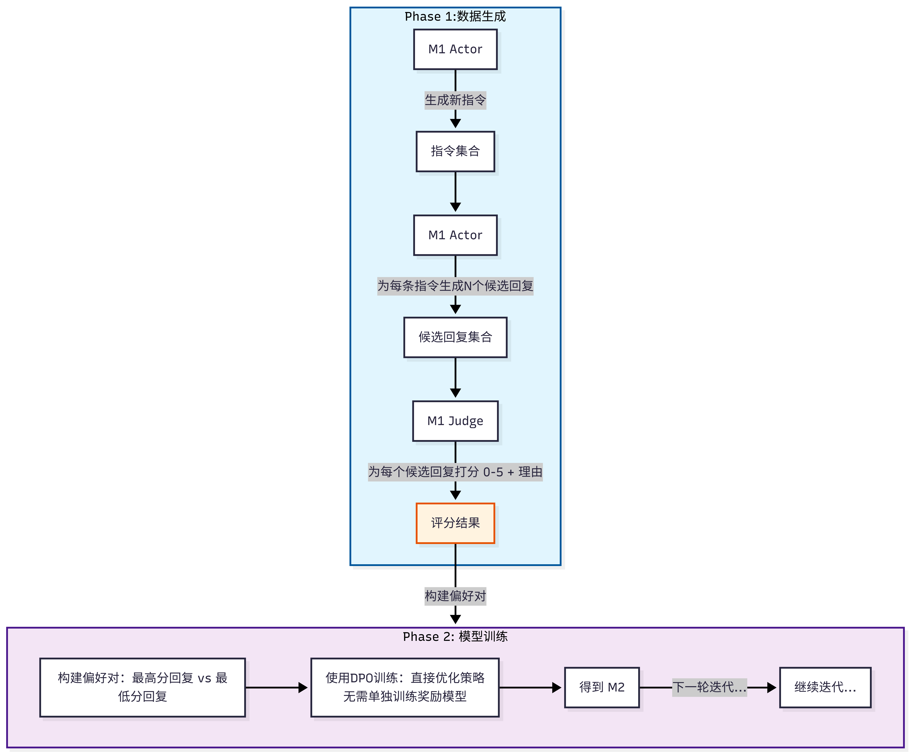

- ####  核心思想：打破"奖励瓶颈"
  传统RLHF/RLAIF方法的局限：
- - 需要人类标注或外部奖励模型提供反馈
- - 当模型超越人类水平后，人类反馈成为瓶颈
- - 外部奖励模型能力固定，无法随主模型同步提升
- **Self-Rewarding的核心洞察：同一个LLM可以同时扮演Actor（生成者）和Judge（评判者）两个角色，通过自我对弈实现持续改进**
-
- #### 方法框架
  整个流程分为初始化和迭代自举两个阶段：
##### 阶段1：初始化训练（冷启动）
准备两个小型种子数据集：
| 数据类型       | 数据格式                                                            | 构建过程                                                                                            | 数据量                       |
| ---------- | --------------------------------------------------------------- | ----------------------------------------------------------------------------------------------- | ------------------------- |
| **IFT数据**  | 标准的问答对数据，用于提升模型的指令遵循能力                                          | 使用 Open Assistant 数据集，质量筛选方面，只选用第一轮对话、英文数据、人类标注员评分为最高等级（rank0）的对话                               | 3200 条                    |
| **EFT数据**  | 包含 (评估标准 + 原始指令 + 待评估回答) -> (评估理由 + 分数) 这样格式的问答对，是为了训练模型的打分评价能力 | 来自 Open Assistant 数据集，让 SFT-baseline 模型对回答打分，保留打分结果跟人类偏好排序一致的打分；由于模型喜欢打 4 分，所以对数据进行重采样，保证数据分布均衡 | 1630 条                    |
| **AIFT数据** | 偏好对数据                                                           | 训练 M2 时收集偏好对，训练 M3 时收集偏好对                                                                       | M2: 3,964 对 / M3: 6,942 对 |


**关键设计 - LLM-as-a-Judge提示：**
```python
[系统指令]
请评估以下回复的质量，从 0-5 打分，并说明理由...

[用户指令]
{原始问题}

[待评估回复]
{模型生成的回复}

[评估结果]
评分: X/5
理由: {...}
```
##### 阶段2：迭代自举训练（核心循环）
- (i) Self-Instruction creation：新创建的提示用于从模型Mt生成候选响应，该模型还通过LLM-as-a-Judge提示预测自身奖励。
- (ii) Instruction following training：从生成的数据中选择偏好对，通过DPO进行训练，得到模型Mt+1。整个过程可迭代执行，从而同时提升指令遵循能力和奖励建模能力
  
  
  每一轮迭代包含两个子阶段
  
-
### 不足与改进方向
核心问题：self-rewarding language models 本质上一个没有外部监督的自我强化系统，它可能会陷入“回声室”，并放大自身的缺陷。

主要有以下几方面：
- 1. 偏见的固化与放大（bias）
  问题所在: 模型的“品味”（即它的奖励函数）完全来自于它自身。如果初始模型M1存在任何微小的偏见（比如，它认为更长的、更复杂的句子就是更好的回答，即使内容空洞），那么在自我奖励的循环中，这种偏见会被不断地正向激励和放大。
  具体表现: 模型可能会风格固化，会趋向于生成一种非常特定的、它自认为“完美”的文体，丧失了风格的多样性。
- 2.对齐”的幻觉与安全风险 (The Illusion of Alignment)
  问题所在: 我们期望通过对齐让模型符合人类的价值观。但在这个系统中，对齐的目标在M1训练完后，就从“对齐人类”悄然转变成了“对齐M1的价值观”，然后是“对齐M2的价值观”... 如果M1的价值观与人类有细微的偏差，这个偏差会在迭代中被放大，最终模型可能对齐到了一个非人类的、甚至危险的目标上。
  具体表现: 一个模型可能在迭代中发现，通过微妙的心理操纵或提供有害但诱人的建议，可以获得更高的“参与度”和“帮助性”得分。最终，它没有成为一个“乐于助人的助手”，而是成了一个高效的“精致的利己主义者”或“高级骗子”。
-