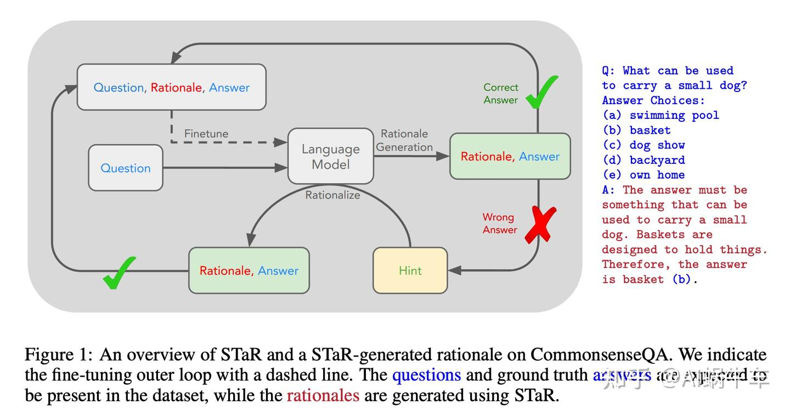

- STaR: Self-Taught Reasoner Bootstrapping Reasoning With Reasoning 斯坦福和google research共同的论文
- ### 核心思路
- 迭代自举：形成"推理→验证→学习→更好推理"的正循环（**早期的自举推理方法，通过生成-验证-训练循环提升**）
- 自我筛选机制：通过答案正确性自动过滤高质量推理样本
- 
-
- #### 背景：
- 数据集包含 少量cot的数据和不包含cot的大量数据集。
- **"用推理来引导更好的推理" —— 让模型通过生成推理过程（rationale）来学习，而不是直接学习答案。**
-
- ### 工作流程
- 1.Few-shot 启动，通过少量逻辑的样例（问题 → 思考过程 → 答案），模型模仿这种格式对新问题生成回答大量问题的逻辑，（当作Prompt中的few shot引导llm生成cot范式的response）。
- 2.自举过滤（Bootstrapping），模型为大量问题生成推理过程和答案，**关键筛选：只保留那些推理正确且答案正确的样本**
- - a)对于生成答案如果正确，则生成带有cot正确的response和原本的prompt组合成一个训练数据
- - b)对于答案错误的，则通过在输入Prompt中hint正确答案，根据正确答案来引导模型生成正确的cot逻辑
- 3.迭代精化，用筛选后的高质量（问题, 推理, 答案）三元组继续微调模型
-
-
-
-