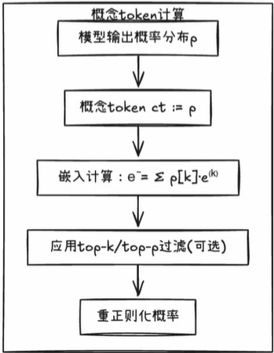
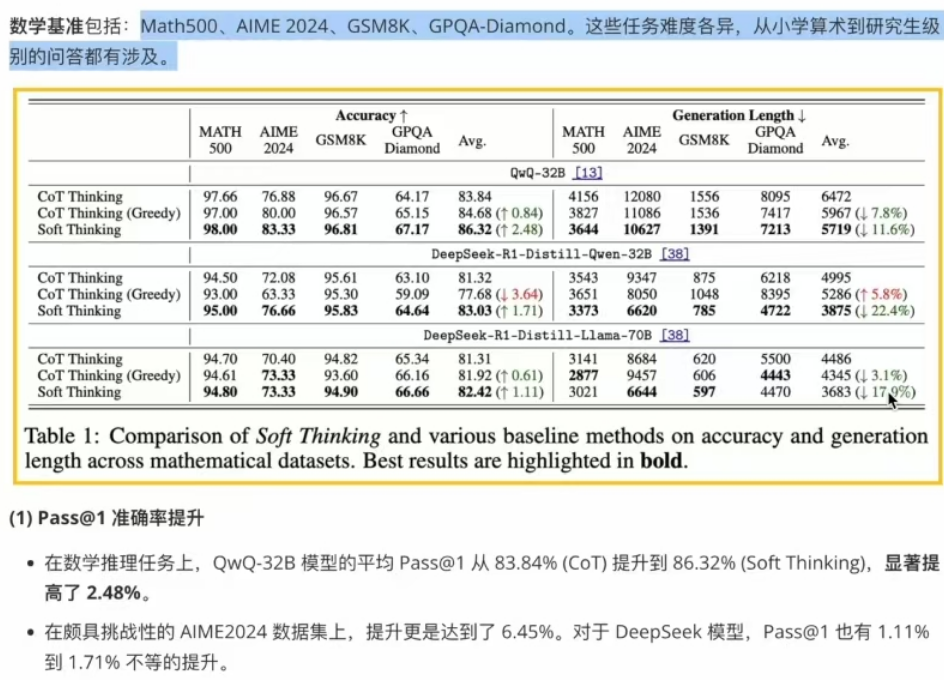

- Soft Thinking: Unlocking the Reasoning Potential of LLMs in Continuous Concept Space
  论文地址：  https://arxiv.org/abs/2505.15778
  项目地址：  https://github.com/eric-ai-lab/Soft-Thinking
- Soft Thinking，核心目标只有一句话：
  “让大模型像人一样，在抽象的连续概念空间里做推理，而不再被离散 token 束缚。
-
-
- ### 背景：为什么要摆脱“离散 token”限制？
  大语言模型（LLM）在复杂推理任务中大放异彩，而链式思考（Chain-of-Thought, CoT）通过生成中间步骤进一步提升了推理表现。 但标准 CoT 依然存在四大痛点：
	- 1. **离散符号受限**
	- 每步仅选出一个固定 token，表达粒度受限于人为定义的词表。
	  
	  2. **背离人类认知**
	- 神经科学研究表明，人脑推理依赖抽象概念而非单个词元。
	  
	  3. **早期决策 + 单路径**
	- 序列式采样迫使模型过早锁定一路径，一旦偏离就难以回溯。
	  
	  4. **高不确定任务易失误**
	- 多条可行路线时，模型可能走错分支，既浪费 token 也降低准确率。
	-
- ### Soft Thinking: 走向连续概念空间
  为打破离散局限，论文提出 Soft Thinking —— 一个无需额外训练的推理范式。
- 为了解决LLMs在离散空间推理的限制，论文提出了 Soft Thinking 方法。这是一个无需额外训练（training-free）的方法，旨在让LLMs能够在**连续的概念空间**（continuous concept space）中进行推理。
- Soft Thinking的核心创新点在于，它取代了标准CoT中离散的词元选择过程。在标准的CoT中，模型在每一步推理后会生成一个对词汇表所有词元的概率分布，然后从中“硬”地选择（采样）一个词元作为下一步的输入。Soft Thinking则不同，它保留了**原始完整的概率分布**。
- 传统CoT
	- 每步仅选择一个最高概率token
	- 单一推理路径
- 连续CoT vs Soft Thinking
	- 保留整个词汇表的概率分布
	- 连续概念空间推理
	- 同时涵盖多个潜在路径
-
- ### 概念 token (Concept Token)
  在任何中间推理步骤，LLM 会输出一个关于整个词汇表上所有词元的概率分布 \( p \)。
  这个概率分布 \( p \) 本身就被称为一个概念词元（\( ct := p \)）
  \[ ct := p \in \Delta^{|V|-1} \]
  与传统方法强制将分布塌缩到单个词元不同，概念词元保留了每个可能下一步的完整分布信息。这保留了每一步的“叠加态”信息。
-
- ### 连续概念空间
  
  通过对词汇表中所有词元的嵌入向量按该概率加权求和，即可构造连续的概念空间。
  
  \[ C = \left\{ \sum_k \alpha_k e^{(k)} \mid \alpha \in \Delta^{|V|-1} \right\} \]
  
  其中 \( e^{(k)} \) 是第 \( k \) 个词汇项的嵌入向量，\( \alpha \) 是概率分布。soft thinking在这个连续概念空间中进行推理。
  
  Soft Thinking 利用这种概率加权插值，使概念 token 表示更加平滑丰富，超越了单个离散词元的表达能力。
-
- **连续概念空间中的推理过程（Reasoning Process）：**
  在Soft Thinking框架下，每一步推理生成一个概念 token 后，将其“再输入”模型继续推理。
  
  具体过程是：
  1. 模型先输出下一个词元的概率分布 \( p \)（定义为概念 token：\( ct \)）；
  2. 然后计算该概念 token 的嵌入 \( \tilde{e} = \sum_k p[k] e^{(k)} \) 并将其作为下一个输入向量。这样，模型实际上在连续概念空间中前进。
  3. 只要当前概念 token 的最高概率词元不是结束词元（</think>），推理过程就继续进行。一旦最高概率词元为“结束思考”，模型终止中间推理阶段，转入按普通方式生成最终答案的输出阶段。
-
- **概念token的数学定义与嵌入计算：**
  概念token即模型在当前时刻对下一个词元分布的概率向量 \( p \)，其对应的嵌入向量通过概率加权求和得到，即
  
  \[ \tilde{e}_{\text{next}} = \sum_{k=1}^{|V|} p[k] \, e^{(k)} \in \mathbb{R}^d \]
  
  这里 \( e^{(k)} \) 是第 \( k \) 个词元的嵌入向量，这个加权和得到的 \( \tilde{e}_{\text{next}} \) 就位于连续概念空间 \( C \) 中。
  
  为了减少计算量，实际实现时通常会先对概率分布做 top-k/top-p 过滤，保留概率最高的若干词元，再重正则化并计算加权和。整个过程仅利用了原有模型的嵌入矩阵，无需额外学习参数。
  
  概念token计算流程：
- 
- ###  Cold Stop（ 冷停止 基于熵的早停机制）
- **问题背景**
- 虽然概念词元使得抽象推理成为可能，但将连续的概念词元作为输入传递给模型，实际上是将模型置于一个分布外（Out-of-Distribution，OOD）的状态。
- 这是因为LLMs通常只在离散词元序列上进行训练。如果推理过程过长，这种OOD输入可能导致模型崩溃（model collapse），例如开始重复生成无意义的内容。
  
  **基于熵的早停机制概述**
- 早停规则：
  如果当前步骤的熵 \( H(p) < \tau \)，就增加低熵步骤计数器；否则重置计数器。
- 当计数器达到 \( k \) 时，强制插入一个“思考结束”词元（</think>），结束推理并开始生成最终答案。
- 这个机制避免了不必要的计算，并在处理OOD输入时减轻了**模型崩溃**的风险，提高了推理的鲁棒性和效率。
-
- ### PipeLine:
  模型正常处理输入提示，直到达到指定的思考阶段。
  在每个中间思考步骤中，模型不是选择单个 token，而是生成一个关于词汇表的概率分布（即“概念 token”）。
  此概念 token 用于计算加权嵌入，方法是根据其概率对所有 token 嵌入进行加权求和。
  加权嵌入作为输入被注入回模型，用于下一步推理。
  此过程持续多个步骤，模型在连续概念空间中运行。
  对于最终答案生成，模型恢复为标准离散 token 选择。
  该方法是免训练的，这意味着它可以应用于现有的预训练模型，而无需任何微调或额外训练。
-
- ##### 软思考 VS 传统 CoT 总结：
  软思考减少了 LLM 里面的反思重新再来行为，提升了 token 效率，
- 传统：选择一条路径 → 发现错误 → 需要重新开始 → 浪费tokens，
  而Soft Thinking：同时保持多个选项的概率权重 → 自然收敛到正确路径。
-
-
- 实验结果：
- 