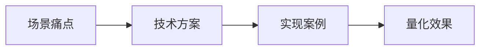

- ## 1. 防护核心维度 
  
  1\. **数据安全**
- 联邦学习架构（医院本地部署模型副本，仅上传加密梯度）
- 差分隐私技术（训练数据添加噪声 $\epsilon \leq 0.5$）
- 混合部署架构（敏感数据用私有云，非敏感用公有云）
- 动态脱敏策略（根据医生权限隐藏字段）  
  
  2\. **模型鲁棒性**
- 对抗训练（FGSM方法生成对抗样本，20%比例注入）
- NLP防火墙（BERT文本分类器检测异常输入，拦截率87%）  
  
  3\. **权限与合规**
- ABAC模型（XACML策略引擎配置200+规则）
- LIME算法生成可解释报告（医学证据可视化）
-
- ## 2. 典型行业案例
- ### 2.1 医疗场景案例
- **痛点**：
	- 数据隐私风险（病史/影像报告泄露）
	- 对抗攻击（伪造症状导致误诊）
	- 权限控制不足（非授权访问敏感数据）
	- 可解释性缺失（缺乏医学依据支撑）
- **解决方案效果**：
	- 模型准确率下降≤1.2%
	- 医生投诉率↓62%
	- 权限违规操作↓99%
	- 医生采纳率从75%→89%
	-
- ### 2.2 金融风控案例
- **攻击手段**：  
  构造虚假征信数据（收入>100万但负债超标）
- **防御方案**：
	- 数据增强（合成对抗样本）
	- Auto-encoding检测异常输入
	- 影子模型监控行为异常
- **效果**：  
  攻击成功率从45%→3%，业务损失减少$2.3M
-
- ## 3. 技术实现细节
### 3.1 联邦学习实现
- 采用Secure Aggregation协议（原始数据不离开医院）
- 符合HIPAA标准，准确率损失≤1.2%
-
### 3.2 差分隐私优化
- 患者年龄/性别字段添加噪声 $\epsilon \leq 0.5$
- 隐私保护强度↑37%，F1值仅降0.8
-
### 3.3 对抗训练参数
- FGSM方法生成对抗样本
- 对抗测试集准确率从89%→93%
-
- ## 4. 面试应答框架
  1\. **防护原则**
- 隐私优先（联邦学习+差分隐私）
- 动态防御（对抗训练+实时过滤）
- 合规驱动（GDPR/HIPAA审计）  
  
  2\. **趋势方向**
- 隐私计算（多方安全计算）
- AI原生安全（模型自带防御机制）  
  
  3\. **应答技巧**
- 量化指标（如"拦截率87%"）
- 批判性讨论（如联邦学习的通信开销问题）
## 5. 结构化表达逻辑  

- ###  总结
  
  本视频系统阐述了大模型安全防护的三大核心维度（数据安全、模型鲁棒性、合规管理），通过医疗和金融行业的具体案例，详解了联邦学习、差分隐私、对抗训练等关键技术方案的实现细节与量化效果。面试应答应聚焦"痛点-方案-效果"逻辑链，强调隐私优先原则和动态防御机制，同时需展示对技术局限性的深度理解（如联邦学习的通信开销）。典型数据：医疗场景中医生采纳率提升14%，金融风控攻击成功率降低42个百分点。
-
-
-
- # 大模型合规管理
  定义： 在大模型全生命周期（训练、部署、调用、内容输出）中，用一套“技术+制度”组合手段，确保模型及其应用同时满足法律法规、行业监管、企业内部风控三类要求，把“模型可能违法/违规/泄密/伤人”的风险降到可控范围内。
-
- #### 落地要用的“技术工具箱”
- | 阶段         | 关键技术             | 作用                                        |
  | ---------- | ---------------- | ----------------------------------------- |
  | **1. 训练前** | 数据合规准入引擎         | 自动扫描训练集，把版权侵权、未脱敏个人信息、5% 以上违法文本全部剔除 。     |
  | **2. 训练期** | 安全对齐微调（SFT+RLHF） | 用“拒答样本”“价值观样本”微调，让模型学会拒绝违法请求 。            |
  | **3. 部署期** | 内容围栏+敏感词+语义风控    | 输入先过“九类敏感库”，输出实时比对“政治/暴力/色情/金融诈骗”等黑样本 。   |
  | **4. 调用期** | ABAC/XACML 细粒度授权 | 谁、在什么网络环境、能调用哪版模型、能看多高级别数据，全部策略化 。        |
  | **5. 运行期** | 生成水印+可追溯日志       | 每条输出打不可见水印，记录 Prompt、UID、时间、IP，事后可定位责任人 。 |
  | **6. 审计期** | 合规报告自动生成         | 把模型日志、风险事件、整改记录自动写入模板，一键输出给监管 。           |
- ##### 目前在公开社区/论文里可直接拿到的 5 套中文/英文数据集
- 按“先通用后垂直”顺序排列，拿来就能塞进 SFT/RLHF 流程。
	- | 名称                 | 语言   | 规模                    | 核心字段示例                                                           | 特点                                  | 下载地址                                                |
	  | ------------------ | ---- | --------------------- | ---------------------------------------------------------------- | ----------------------------------- | --------------------------------------------------- |
	  | FalseReject        | 英文   | 16 k 条                | prompt / safe\_or\_ununsafe / refusal\_reason / expected\_answer | 覆盖 44 类敏感话题，含链式思考模板，可缓解“过度拒绝”       | Hugging Face: `AmazonScience/FalseReject`           |
	  | WildChat           | 英文为主 | 约 1 M 对话 2.5 M 轮次  | prompt / response / refusal\_flag / toxicity\_score              | 真实用户与模型对战日志，含大量越狱与拒答案例，多语言          | Hugging Face: `allenai/WildChat-1M-Full`            |
	  | MM-SafetyBench     | 英文   | 5 k 图文对               | image\_path / prompt / refusal\_target / label                   | 多模态拒答，含 typo 变形攻击，覆盖色情/暴力/隐私等 8 类风险 | GitHub: `Vision-Security-Group/MM-SafetyBench`      |
	  | Rex-Thinker-Refuse | 中文   | 5 k 条描述 （1 k 强制拒答） | description / has\_target / refusal\_reason                      | 中文视觉指代任务，教会模型“找不到物体就拒答”，缓解幻觉        | Hugging Face: `IDEA-Research/Rex-Thinker`           |
	  | PALMS-80           | 英文   | 80 条高质量               | topic / prompt / ideal\_answer                                   | OpenAI 小样本价值观标杆，80 条即可显著降低有害输出      | 论文附录 arXiv:2106.13814（GitHub 搜索 `PALMS_dataset` 亦可） |
- 一句话总结：拒答用 FalseReject/WildChat，价值观用 PALMS-80 自拓，中文视觉再补 Rex-Thinker，多模态加 MM-SafetyBench，四包料按 7:1.5:1.5 比例拌在一起做 SFT+RLHF，就能让大模型“该答的答、该拒的拒、拒得还让人类挑不出毛病”。