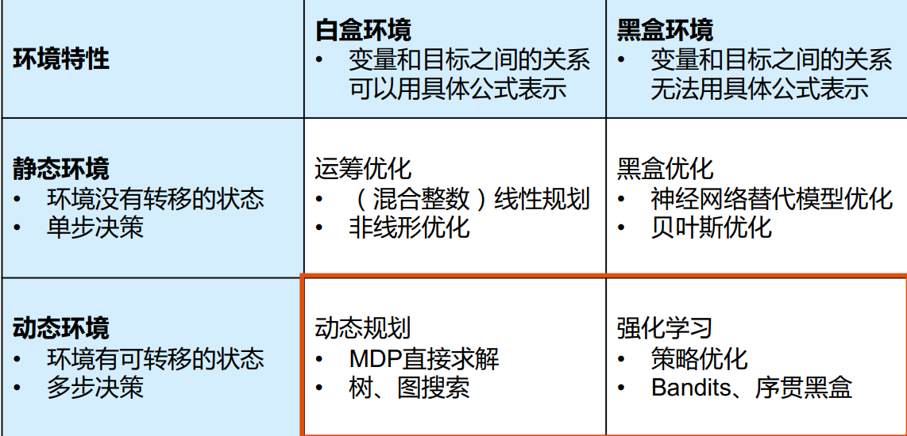
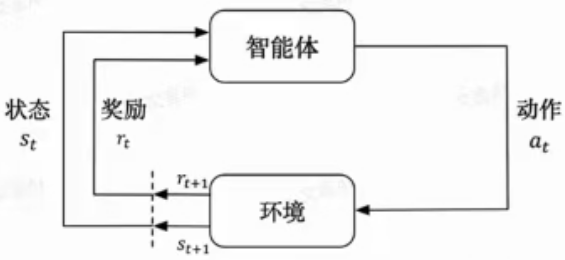
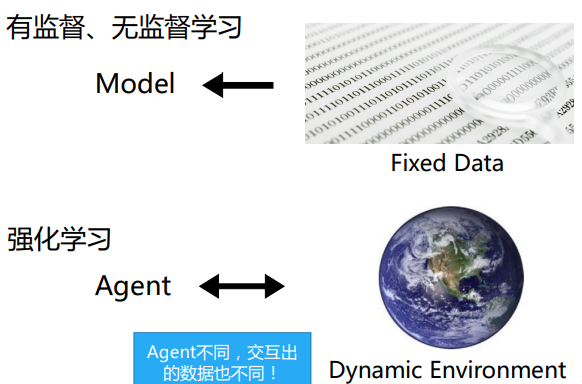
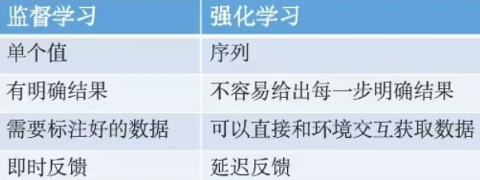

collapsed:: true
1. 强化学习技术概览 
2. 马尔可夫决策过程
3. 值函数估计 
4. 无模型控制方法 
5. 参数化值函数 
6. 策略梯度 
7. 深度强化学习 – 价值方法 
8. 深度强化学习 – 策略方法

- ### 模型学习任务分为两类： 预测型的任务 （只预测环境不改变环境）和 决策型任务（改变环境）
- 
-
- ### 强化学习的定义：
- 学习做什么(即如何把当前的情境映射成动作)才能使得数值化的收益信号最大。---出自《Reinforcement Learning: An Introduction》
- 强化学习的两个实体：智能体（Agent）与环境（Environment）
- 
- **状态空间S**：S即为State，指环境中所有可能状态的集合
- **动作选择空间A**：A即为Action space，指智能体所有可能动作的集合
- **奖励R**：R即为Reward，指智能体在环境的某一状态下所获得的奖励。
- **策略P**：P即为Policy， 是智能体的行为方式
- 智能体在这个过程中学习，它的最终目标是：
  **找到一个策略，这个策略根据当前观测到的环境状态和奖励反馈，来选择最佳的动作。**
-
-
- 强化学习与传统model有监督学习的区别：
- **训练数据（交互数据）随着agent变化**而变化的
- 
- 
-
- ### 如何描述决策型任务
- 面对决策型任务如何用数学去描述这个过程？----- MDP马尔科夫决策过程
- ##### 1.马尔可夫过程MP
-
- ### 如何优化策略
- ##### 1. 状态价值函数 与 动作价值函数的定义
- 
- 
- ##### 2. 目标：选择能够最大化累积奖励期望的动作
- {:height 188, :width 776}
-