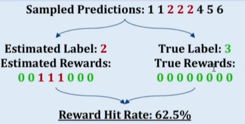

- 目前无监督强化学习构建奖励信号主要有三种方式
  1、多数投票
  2、置信度
  3、熵
-
- ### 1、TTRL
- 1. 输入处理：给定一个提示x，LLM会对其进行处理以生成响应。
  2. 多次采样：模型通过从其策略πθ(y|x)中采样来生成N个候选输出{y₁, y₂, ..., yₙ}。
  3. 共识形成：应用多数投票来确定最常见的答案y*，作为正确答案的代理。
  4. 奖励计算：每个采样的输出都会根据其与共识答案的一致性获得奖励（如果匹配，则为1；否则为0）。
  5. 策略优化：使用诸如PPO或GPO之类的RL算法更新模型的参数θ，以最大化预期奖励。
-
- 为什么有效：
- 
- 真实标签：如果模型预测结果为 \(\{1,1,2,2,4,5,6\}\)，真实标签为3，此时模型得到的奖励是值为0，从GRPO来说，优势也为0，那么梯度为0，对模型是没有丝毫增益的。
- 多数投票标签：将多数投票的结果当作标签（为2）。虽然Positive reward是错的。但negative reward还是对的。也就是说即便majority voting错了，但negative信号是对的。
-
- ### 2、RLIF  
  使用模型的自我确定性作为奖励信号，无需真实标签
- 自我确定性的衡量方法：模型输出分布与均匀分布之间的平均KL散度。模型在预测下一个词时，如果对自己的预测非常自信，那么预测下一个词的概率分布必然是非常尖锐的（某些词的预测概率很高），如果对自己的预测不自信，那么预测下一个词的概率分布会比较平坦（模型不太确定下一个词是什么，不同词的概率相差不大）。所以通过模型输出的概率分布比均匀分布之间的差异来衡量模型的自我确定性，差异越大，模型越自信。
- 目标函数：
  公式：
            \[
  \max_{\pi_\theta} \mathbb{E}_{o \sim \pi_\theta(q)} \left[ u(q, o) - \beta \text{KL}[\pi_\theta(o|q) \| \pi_{\text{ref}}(o|q)] \right]
             \]
-
-
- ### 3、RENT  
  使用熵作为奖励信号，通过最小化熵来优化模型。随着熵的减少，模型输出的确信度会越来越高。
- 公式：
              \[ H(p_t) = -\sum_{v \in V} p_t(v) \log p_t(v) \]
-
-
- ##### tips： 不管是利用投票、置信度还是熵，随着训练的进行，会出现熵塌缩的现象，模型基本丧失探索能力，导致效果下降。但是在合理的steps内，效果是会有一定提升的。
-